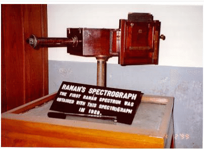
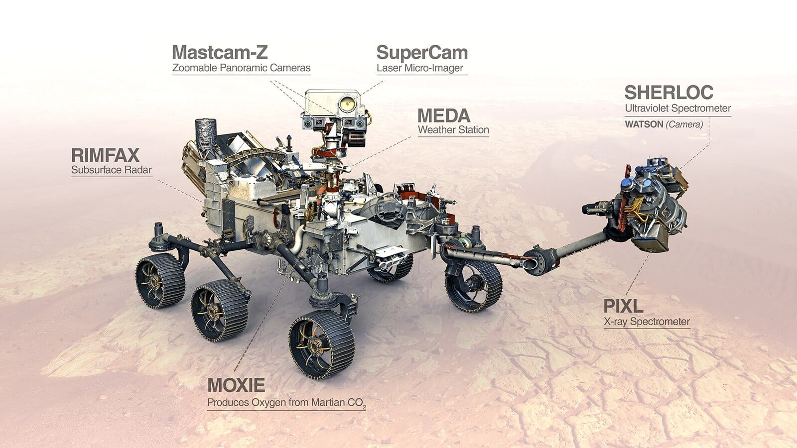
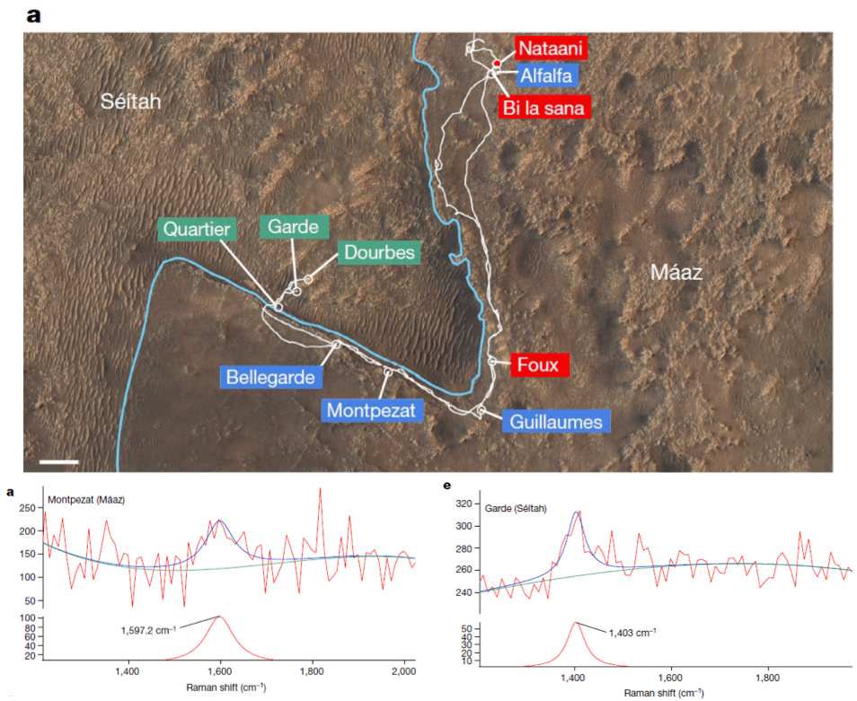
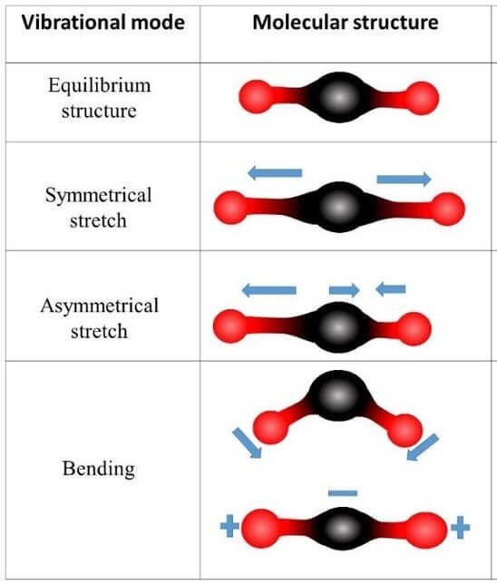

{}
Entrada basada en el siguiente hilo de Twitter:



{}

Vamos a ver la historia y el efecto relacionado con [**Chandrasekhara Venkata Raman (C. V. Raman)**](https://es.wikipedia.org/wiki/Chandrasekhara_Raman), un destacado físico hindú que dejó una huella imborrable en la ciencia. Su nombre está asociado a un efecto que no solo aprovechamos aquí en la Tierra sino también en la [exploración de **Marte**](https://es.wikipedia.org/wiki/Exploración_de_Marte).

C. V. Raman nació en 1888 en la [Provincia de Madrás](https://es.wikipedia.org/wiki/Presidencia_de_Madrás) de la [India Británica](https://es.wikipedia.org/wiki/Raj_británico). Fue el segundo hijo de ocho de una familia humilde. "*Nací con una cuchara de cobre en la boca.*" De niño aprendió, de su padre, profesor de física en un colegio, a manejar instrumental eléctrico.



Con 30 años, C. V. Raman ya era catedrático de física de la [Universidad de Calcuta](https://es.wikipedia.org/wiki/Universidad_de_Calcuta). Se dice que, según contemplaba el mediterráneo en su primera visita a Europa, decidió investigar el color azulado del agua, que no se debe al reflejo del cielo azul (como sostenía [Lord Rayleigh](https://es.wikipedia.org/wiki/Lord_Rayleigh)).

Y es que Raman y Rayleigh tienen mucho en común más allá de ser físicos y empezar por "*Ra*"; ambos dan nombre a una forma distinta de dispersión de la luz. La de Rayleigh la vimos en la [entrada del cielo azul](), ya que es la principal causa de su color (pero no la única). Cuando la trayectoria de la luz se ve modificada por la materia, lo más habitual es que lo haga *de forma Rayleigh*, que quiere decir que su energía (y por tanto, su longitud de onda y su color) no cambia. Sin embargo, hay un pequeño porcentaje de luz cuya energía sí cambia:



Esas pocas partículas de luz experimentan la llamada [***dispersión Raman***](https://es.wikipedia.org/wiki/Efecto_Raman), que nos devuelve a nuestro protagonista y a la física de los años 20. Vayamos a finales de 1927, donde C. V. Raman y su estudiante [K. S. Krishnan](https://en.wikipedia.org/wiki/K._S._Krishnan) reciben una noticia que les cambiará la vida. En 1923, [Arthur Compton](https://es.wikipedia.org/wiki/Arthur_Compton) había hecho incidir [rayos X](https://es.wikipedia.org/wiki/Rayos_X) en blancos de [grafito](https://es.wikipedia.org/wiki/Grafito) y había observado un aumento de su longitud de onda. Lo explicó partiendo de la recientemente postulada naturaleza cuántica de la luz por Planck y Einstein. En 1927 obtuvo el Nobel de Física.



Según un testigo, al oír la noticia, Raman le dijo a Krishnan: "*Gran noticia. Pero escucha, si esto ocurre en los rayos X, debe haber un análogo en la luz visible.*" Para la luz visible no era tarea fácil; había que generar y detectar suficientes fotones que sufrieran ese efecto.

Mediante luz de una [lámpara de mercurio](https://es.wikipedia.org/wiki/Lámpara_de_vapor_de_mercurio) filtrada y un espectrógrafo desarrollado por él mismo, Raman y Krishnan lograron observar este efecto y comunicarlo en varias notas publicadas en la revista Nature en febrero de 1928, como esta donde aparece la primera imagen del efecto:

, publicada por C. V. Raman y K. S. Krishnan en Nature. Pocas semanas antes ya habían publicado dos *comments* sobre el mismo tema en la misma revista, pero sin imagen. Fuente: https://www.nature.com/articles/121711a0.")

La imagen (1) muestra las energías o longitudes de onda incidentes en el [tolueno](https://es.wikipedia.org/wiki/Tolueno). La imagen (2) igual, pero para la luz dispersada. Las líneas con brillo saturado coinciden ([dispersión de Rayleigh](https://es.wikipedia.org/wiki/Dispersión_de_Rayleigh)) pero hay unas líneas (etiquetadas a y c) que no; ahí está la [***dispersión Raman***](https://es.wikipedia.org/wiki/Efecto_Raman). En 1930, C. V. Raman fue distinguido como "*Sir*" y ganó el premio Nobel por este descubrimiento, que llevaría su nombre hasta hoy. El 28 de febrero se celebra el Día Nacional de la Ciencia en India en su honor.

 en la ceremonia Nobel. Fuente: https://www.edinst.com/blog/the-life-of-c-v-raman/.")

Resumida su historia, veamos cómo aprovechamos este efecto hoy en día. Hace menos de un mes salió esta noticia en prensa[^1]:

[^1]: Prefiero no trasladar conclusiones precipitadas que van más allá de mi campo, solo diré que parece que la explicación de vida antigua no es la única posible. En [este hilo](https://twitter.com/MarGomezH/status/1679440835027390465), Mar Gómez explica con detalle la mencionada noticia.



El [rover **Perseverance**](https://es.wikipedia.org/wiki/Perseverance), la mayor misión a Marte de la historia, aterrizó en el [cráter Jezero](https://es.wikipedia.org/wiki/Jezero_(cráter)) hace 2.5 años para explorar el delta del antiguo río que parece que hubo allí. El equipo publicó recientemente la detección de compuestos orgánicos complejos. Dejo los detalles para quien sepa de [astrobiología](https://es.wikipedia.org/wiki/Astrobiología); aquí os voy a mostrar la base de la [espectroscopía Raman](https://es.wikipedia.org/wiki/Espectroscopia_Raman) usada. El Perseverance lleva un equipo llamado [SHERLOC](https://es.wikipedia.org/wiki/Scanning_Habitable_Environments_with_Raman_and_Luminescence_for_Organics_and_Chemicals) acoplado a una cámara llamada WATSON (todo muy [Conan-Doyle](https://es.wikipedia.org/wiki/Arthur_Conan_Doyle)):

SHERLOC consiste en un [láser](https://es.wikipedia.org/wiki/Láser) [ultravioleta](https://es.wikipedia.org/wiki/Radiación_ultravioleta) (248&thinsp;nm) acoplado a un [espectrómetro](https://es.wikipedia.org/wiki/Espectrómetro). Puede medir tanto [fluorescencia](https://es.wikipedia.org/wiki/Fluorescencia) como espectroscopía Raman para identificar distintos compuestos orgánicos presentes en el cráter. Veamos cómo la espectroscopía Raman permite esa identificación:

La energía que pierde la luz por dispersión Raman la adquieren las moléculas en forma de [vibración](https://es.wikipedia.org/wiki/Vibración_molecular). Esa energía es distinta para cada especie molecular, según sus masas, sus enlaces, etc. Por ejemplo, una molécula básica como el [CO2](https://es.wikipedia.org/wiki/Dióxido_de_carbono) tiene estos modos de vibración:

Como hay varios modos de vibración, las moléculas dan lugar a no solo una única energía en el espectro Raman sino varias, como vimos en la imagen publicada por C. V. Raman (aunque ahí no se puedan medir con precisión); fijaos en que hay más de una línea brillante extra:

, publicada por C. V. Raman y K. S. Krishnan en Nature. Pocas semanas antes ya habían publicado dos *comments* sobre el mismo tema en la misma revista, pero sin imagen. Fuente: https://www.nature.com/articles/121711a0.")

Cada especie molecular tiene su huella dactilar de dispersión Raman. Más allá del Perseverance, aquí en la Tierra la espectroscopía Raman se usa en la identificación de fármacos, en el análisis de proteínas biológicas... y, por supuesto, la usamos en [ciencia de materiales](https://es.wikipedia.org/wiki/Ciencia_de_materiales):

<iframe src="https://giphy.com/embed/5Xfn2En9gZybm" width="100%" height="100%" style="position:absolute" frameBorder="0" class="giphy-embed" allowFullScreen></iframe>

<a href="https://giphy.com/gifs/5Xfn2En9gZybm">via GIPHY</a>

Por ejemplo, en uno de mis artículos recientes podéis ver este espectro Raman realizado sobre una nanoestructura alargada de óxido de galio. A partir de la intensidad relativa de sus emisiones Raman, pudimos deducir las direcciones cristalográficas del nanohilo:

. Cada pico corresponde a un modo de vibración distinto de los grupos de átomos que forman el material. Fijaos en el modo Ag(10). Solo aparece cuando orientamos el hilo de manera perpendicular al polarizador. La vibración asociada a ese modo nos indica la dirección cristalográfica del hilo. Fuente: https://onlinelibrary.wiley.com/doi/full/10.1002/smll.202105355.")

Así termina esta entrada de introducción a la espectroscopía Raman. Ha quedado mucho contenido en el tintero; si os interesa decidme en qué os gustaría que me centrara si le dedico una segunda entrada.

{}

**Fuentes** principales:

- https://www.edinst.com/blog/the-life-of-c-v-raman/
- RAMAN, C., KRISHNAN, K. The Optical Analogue of the Compton Effect. Nature 121, 711 (1928). https://doi.org/10.1038/121711a0
- Sharma, S., Roppel, R.D., Murphy, A.E. et al. Diverse organic-mineral associations in Jezero crater, Mars. Nature 619, 724–732 (2023). https://doi.org/10.1038/s41586-023-06143-z

{}