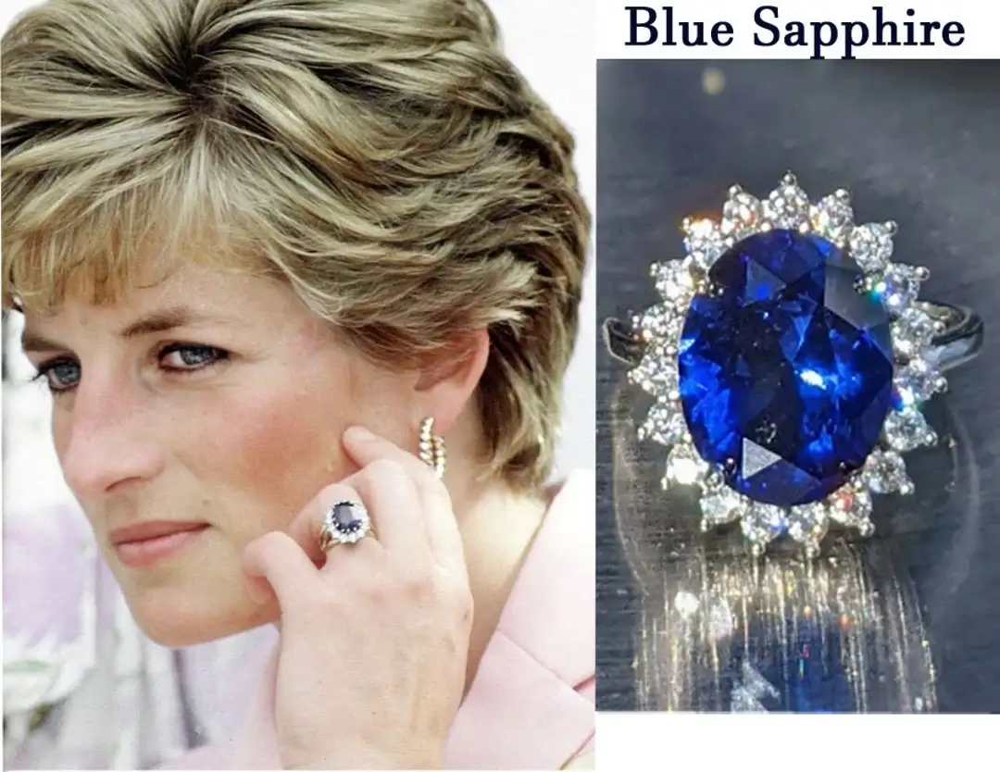
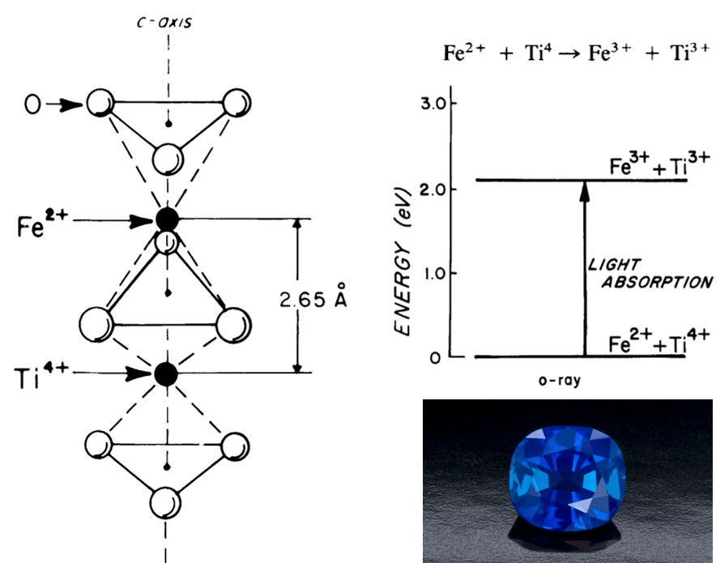
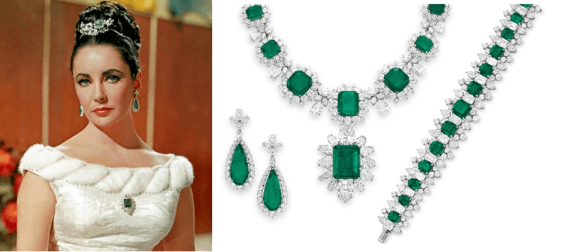

{}
Entrada basada en el siguiente hilo de Twitter:



{}

{}

La ciencia detrás del bello color de las [**piedras preciosas**](https://es.wikipedia.org/wiki/Gema) más cotizadas como el [**rubí**](https://es.wikipedia.org/wiki/Rubí), el [**zafiro**](https://es.wikipedia.org/wiki/Zafiro) o la [**esmeralda**](https://es.wikipedia.org/wiki/Esmeralda) os va a deslumbrar. En esta entrada veremos que se tratan de estructuras cristalinas casi perfectas, cuyas imperfecciones a nivel atómico, paradójicamente, suelen ser la causa de sus fascinantes colores.

## Rubí ♥️

El **rubí** proviene del latín *ruber* por su intenso color rojo que, junto con su escasez y dureza, lo hace muy cotizado en joyería. Cuando en 2011 se subastaron las joyas de [Elizabeth Taylor](https://es.wikipedia.org/wiki/Elizabeth_Taylor), destacó una pieza de 8.2&thinsp;ct (1.7&thinsp;g), vendida por 4.2 millones de dólares.

Para comprender el color de esta y las demás gemas pensemos en una estructura de átomos bien ordenados a la cual se introduce (natural o artificialmente) un pequeño porcentaje de iones “foráneos”. El rubí está basado en el [corindón](https://es.wikipedia.org/wiki/Corindón), una variedad cristalina de [óxido de aluminio](https://es.wikipedia.org/wiki/Alúmina) en la cual el oxígeno y aluminio se empaquetan hexagonalmente, salvo por 1/3 de Al ausentes. La clave está en las impurezas.

. Dependiendo de sus impurezas, el cristal puede ser de un color u otro. A la derecha, la estructura cristalina del corindón (imagen de https://cpictures.homes/corundum-structure), donde se muestra el empaquetado hexagonal (HCP) de los iones de oxígeno y de aluminio y se puede ver que 1/3 posiciones están desocupadas.")

En el rubí hay algunas posiciones de Al3+ ocupadas por [Cr3+](https://es.wikipedia.org/wiki/Cromo) y son esos iones los que cambian la absorción y emisión de luz del cristal y con ello su color.

. Las impurezas de cromo en el corindón le proporcionan su color rojo intenso. A la derecha, la estructura cristalina del corindón donde una de las posiciones hay cromo en vez de aluminio. En general, esta sustitución de aluminio (Al3+) por cromo (Cr3+) ocurrirá solo 1/100 posiciones aproximadamente. Imagen adaptada de https://cpictures.homes/corundum-structure.")

## Zafiro 💍

El **zafiro** suele destacar por su bonito color azul (fijaos en el anillo de compromiso de la [Princesa Diana](https://es.wikipedia.org/wiki/Diana_de_Gales)), y eso que comparte con el rubí la misma estructura cristalina (Al2O3 corindón), reflejando la importancia de la especie atómica de las impurezas en el color.

Imaginemos al zafiro como el rubí, pero con [titanio](https://es.wikipedia.org/wiki/Titanio) y [hierro](https://es.wikipedia.org/wiki/Hierro) en el Al2O3. Cuando hay 2 impurezas de Fe2+ y Ti4+ cercanas, la transferencia de un electrón entre ambas hace que el material absorba luz amarilla. Junto con otros procesos similares, da lugar a su color azul.

## Diamante Hope 💎

Aunque generalmente son incoloros, los [**diamantes**](https://es.wikipedia.org/wiki/Diamante) también pueden mostrar color debido a impurezas. Por ejemplo, el [**Diamante Hope**](https://es.wikipedia.org/wiki/Diamante_Hope), famoso por su tamaño (2.5 x 2 x 2 cm3) y su supuesta [maldición](https://es.wikipedia.org/wiki/Diamante_Hope#La_maldición_atribuida) (varios de sus portadores han sufrido desgracias).

 fue el verdadero [Hombre de la Máscara de Hierro](https://es.wikipedia.org/wiki/El_hombre_de_la_máscara_de_hierro). Trabajaba para el rey [Luis XIV](https://es.wikipedia.org/wiki/Luis_XIV_de_Francia) y se dice que llevó el diamante en una ocasión especial. Poco después, cayó en desgracia con el rey y fue desterrado de Francia y condenado a cadena perpetua. Fouquet pasó 15 años en la fortaleza de [Pinerolo](https://es.wikipedia.org/wiki/Pinerolo). Después de él, lo llevaron [Luis XVI](https://es.wikipedia.org/wiki/Luis_XVI_de_Francia) y [María Antonieta](https://es.wikipedia.org/wiki/María_Antonieta_de_Austria) y después de ellos, [María Luisa, princesa de Lamballe](https://es.wikipedia.org/wiki/María_Teresa_de_Saboya-Carignano). En mi opinión, es un ejemplo de casualidades (gente poderosa a la que le ocurren desgracias) que hacen que se busquen correlaciones que no existen. Fuente: https://www.capetowndiamondmuseum.org/blog/2019/09/5988/.")

Es el ejemplo paradigmático de diamante azul (grisáceo). Obtiene su color de impurezas de [boro](https://es.wikipedia.org/wiki/Boro). El boro aquí no es el causante directo, sino que, al tener un electrón menos que el carbono, genera un nivel de energía (nivel del *hueco del e–*) responsable del color de la gema.

. A la derecha, un esquema de su estructura cristalina, mostrando un átomo de boro (B, en azul) en una de las posiciones de C (en gris). El diamante puro, sin B, es incoloro, aunque también se observan diamantes amarillos debido a la presencia de otra impureza más común del boro; el nitrógeno. Imágenes de https://geology.com/diamond/blue-diamonds/.")

Recientemente en [@orbitalaika_tve](https://twitter.com/orbitalaika_tve) dedicaron un programa a la ciencia del lujo #LaikaLujo. Por ejemplo, aquí podéis ver la curiosa explicación de la formación de los diamantes de [@geologoenapuros](https://twitter.com/geologoenapuros):



## Esmeralda 💚

Volvemos a Elizabeth Taylor, cuyas piezas de **esmeralda** (colgante, collar, pendientes, ...) destacaron por su belleza y por tratarse de regalos de su conocido marido, el también actor [Richard Burton](https://es.wikipedia.org/wiki/Richard_Burton). ¿Qué cristal y qué impureza tenemos esta vez?

El verde intenso de la esmeralda proviene de las impurezas de cromo en el mineral [berilo](https://es.wikipedia.org/wiki/Berilo) (Be3Al2(SiO3)6). Es decir, tenemos la misma impureza que el rubí, pero en otro cristal. En este caso es verde debido a la distinta estructura cristalina en la que se encuentra el ion Cr3+.

 y el mineral berilio (Be3Al2(SiO3)6) es la causante de la gran diferencia de color entre el rubí y la esmeralda, respectivamente. Imagen de https://www.jewellerybusiness.com/features/building-a-palette-using-candy-coloured-gemstones/.")

El rubí, el zafiro, el diamante y la esmeralda son las denominadas “4 piedras preciosas”. Por lo que he leído, se distinguen del resto por ser duras, de color puro y escasas, pero la distinción no es del todo clara y depende del contexto. Terminemos con dos gemas también bellas.

## Amatista 💜

La [**amatista**](https://es.wikipedia.org/wiki/Amatista) es una variedad cristalina del [cuarzo](https://es.wikipedia.org/wiki/Cuarzo). Es decir, está basada en [SiO2](https://es.wikipedia.org/wiki/Óxido_de_silicio(IV)), pero de nuevo una impureza, el [hierro](https://es.wikipedia.org/wiki/Hierro), le da su color violeta. Ya desde el Antiguo Egipto o en Roma (imagen) se usaba para decorar grandes enterramientos o como sello personal.

. Fuente: https://commons.wikimedia.org/wiki/File:Intaglio_Caracalla_Cdm_Paris_Chab2101.jpg.")

En el cuarzo, generalmente blanco o incoloro, el hierro actúa de manera ligeramente distinta a los casos anteriores; forma un “[centro de color](https://es.wikipedia.org/wiki/Centro_de_color)”. Simplificando, no es la impureza sino el complejo iónico formado por ella el originario del hermoso color violeta de la amatista.

 y en la B la impureza de hierro que, indirectamente, da su color a la amatista. Imágenes tomadas de https://www.webexhibits.org/causesofcolor/12.html (adaptada) y https://www.geologyin.com/2018/05/what-causes-purple-color-of-amethyst.html.")

## Ópalo 🌈

Del sánscrito “upala” = joya, también ha sido portado (en su variedad preciosa) por la realeza. También está basado en SiO2 pero, a diferencia de los casos anteriores, ni sus átomos están ordenados a gran escala (no es un monocristal) ni su color se debe a impurezas.

 recibió el colgante y los pendientes de [ópalo Andramooka](https://en.wikipedia.org/wiki/Andamooka_Opal) del gobierno australiano. Fuente: https://www.opal-information.com/famousroyalopals.html.")

El motivo del color del **ópalo** lo podéis encontrar en [esta entrada, en el apartado de iridiscencia](). Resumiendo, se trata del orden estructural a escala de la luz el que le da esos colores tan variados. Un fenómeno similar ocurre en algunos seres vivos, como por ejemplo en las alas de las [mariposas *Morpho* azules](https://es.wikipedia.org/wiki/Morpho).

Espero que os haya deslumbrado esta entrada sobre la base física-química del color de las piedras preciosas.

{}
Parte de la información científica la he obtenido de [este **artículo**](https://onlinelibrary.wiley.com/doi/10.1002/col.5080120105) (también publicado como libro).

Te recomiendo también echar un vistazo a [esta magnífica **entrada**](https://yoquierosercientifico.blogspot.com/2018/01/yo-quiero-ser-gemologa-victoria-lopez.html) de **Victoria López-Acevedo**, gemóloga y Profesora Titular en la Universidad Complutense de Madrid.
{}