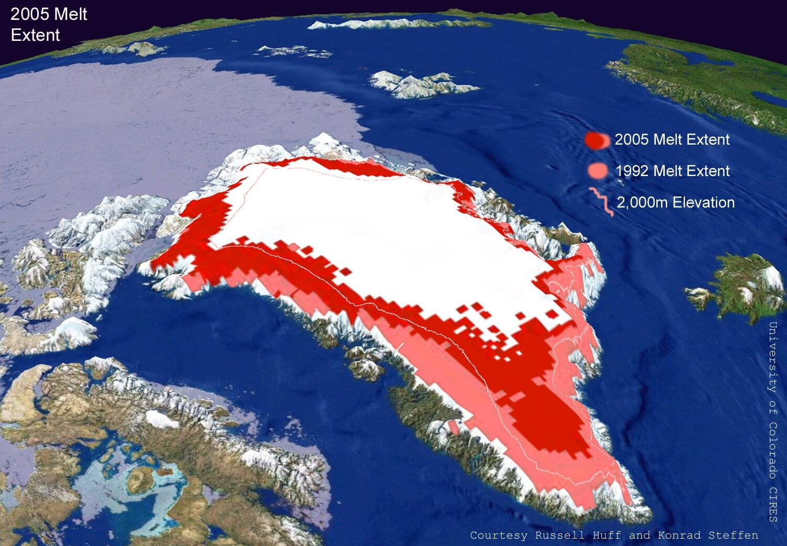

{}
Entrada basada en el siguiente hilo de Twitter:



{}

Todos hemos oído hablar del aumento de los niveles del océano que estamos sufriendo debido al cambio climático. Sin embargo, hay confusión sobre qué está causándolo realmente. Vamos a aclararlo en esta entrada. Empecemos con una pregunta para probar tu intuición. Antes de seguir leyendo, responde a esta pregunta sin buscar información.



### Nivel del mar

Imagina que todo el hielo que hay flotando en los océanos ártico y antártico se fundiese, convirtiéndose en agua líquida. ¿Qué le ocurrirá al nivel del mar?

1. [x] No subirá nada.
1. [ ] Subirá menos de un metro.
1. [ ] Subirá más de un metro.



Esta misma pregunta se la hicieron a estudiantes de ESO, Bachillerato y Magisterio. Más del 90&thinsp;% respondió la opción C (>1 metro), que NO es la correcta. Vamos a ver por qué y de dónde viene el aumento importante del nivel del mar que estamos viviendo. Para obtener la respuesta partimos del [principio de Arquímedes](), formulado en el siglo III a.C.: "Un cuerpo total o parcialmente sumergido en un fluido experimenta una fuerza de empuje vertical hacia arriba igual al peso del fluido desalojado por el cuerpo":



Entendamos el principio de Arquímedes con dibujos tomados de [la web del prof. Ángel Franco García](http://www.sc.ehu.es/sbweb/fisica/fluidos/estatica/arquimedes/arquimedes.htm). Primero pensemos en una porción de fluido en equilibro con el resto. Ahí, el empuje es igual al peso:

Ahora reemplazamos esa porción por un cuerpo sólido y homogéneo. El empuje, debido a la diferencia entre la presión inferior y superior del agua, empuja hacia arriba. El peso trata de hundir al objeto. Haciendo un diagrama de fuerzas:

Si ahora sustituimos las presiones por el producto de densidades, la gravedad y la profundidad de la cara superior e inferior (*x* y *x+h*, respectivamente) y reordenamos, llegamos al principio de Arquímedes, que relaciona el empuje con el peso del fluido desplazado:

$$
E = \rho_\mathrm f h A g = mg
$$

Si sumergimos un objeto menos denso que el fluido, $E>mg$, una parte de él emerge tal que, en el equilibrio, $E = mg$. Con esto podemos entender por qué el hielo flota en el agua: es menos denso. Si lo sumergimos y lo dejamos libre, tendremos un empuje mayor que el peso; la fuerza resultante lleva al hielo a la superficie del agua, reduciendo el empuje hasta igualarlo con el peso. Solo podemos llegar al equilibrio cuando el hielo se sumerge de tal forma que el peso del agua desalojada equivalga al peso del hielo. Como la densidad del hielo es un 92&thinsp;% de la del agua dulce, esto ocurrirá cuando el 92&thinsp;% del hielo esté sumergido en agua dulce:



\begin{align*}
\mathrm{Empuje} &= \mathrm{Peso} \\\\
V_\mathrm s \rho_\mathrm a g &= V_\mathrm t \rho_\mathrm h g \\\\
V_\mathrm s &= \frac{\rho_\mathrm h}{\rho_\mathrm a}V_\mathrm t \\\\
V_\mathrm s &= 0.92V_\mathrm t
\end{align*}

Ojo, tengo que decir que para este cálculo hemos usado la densidad del agua dulce, luego veréis por qué y lo modificaremos para el agua salada. Siguiendo con la dulce (ej. hielo en un vaso de agua), veamos qué volumen ocupa ese hielo y el agua que se forma después. Por conservación de la masa, al derretirse el hielo la masa de agua debe ser igual a la del hielo original. Expresándolas en función del volumen, obtenemos que el volumen del agua líquida que produce la fusión del bloque de hielo es un 92&thinsp;% del volumen del hielo[^1]:

[^1]: Usamos una densidad del agua de 1.0&thinsp;g/cm3 (agua dulce). El hielo, también el marino, tiene la densidad de 0.92&thinsp;g/cm3.



\begin{align*}
m_\mathrm a &= m_\mathrm h \\\\
V_\mathrm a &= \frac{\rho_\mathrm h}{\rho_\mathrm a} V_\mathrm h \\\\
V_\mathrm a &= 0.92 V_\mathrm h
\end{align*}

¡El volumen del agua aumenta justo el que ocupaba el hielo que había sumergido, dejando el volumen total intacto! Lo podéis comprobar en casa. Echad unos hielos a un vaso con agua y esperad a que se fundan. ¿A que no aumenta el volumen?

[Isabel Moreno](https://twitter.com/IsabelIsamoren) y [Alberto Aguayo](https://twitter.com/fqsaja1) reflexionan sobre esto mismo en sendos posts:



Con este ejemplo, podéis ver en internet algunos mensajes negacionistas del cambio climático, explicando que, de la misma forma, el nivel del mar no puede subir por mucho que se esté derritiendo el hielo marino. Esta afirmación tiene muchos matices, como vamos a ver a continuación.

Primero, el hielo marino se encuentra sobre agua salada. Ésta es más densa que el agua dulce mientras que, debido a ciertos procesos, la densidad del hielo marino es similar a la del hielo "dulce"[^2]. Por ello, la densidad del hielo sigue siendo la que hemos usado en el cálculo anterior, pero el hielo se hunde algo menos en agua salada que en la dulce[^3].

[^2]: Sobre el agua del hielo "dulce", consultar Vrbka, L. and Jungwirth, P. (2007) "Molecular dynamics simulations of freezing of water and salt solutions," *Journal of Molecular Liquids*, **134**(1), 64–70. https://doi.org/10.1016/j.molliq.2006.12.011.

[^3]: Repitiendo los cálculos mostrados anteriormente se obtiene que el volumen sumergido es aproximadamente el 89&thinsp;% del volumen total.

Por tanto, de 100&thinsp;m3 de hielo, 89.3&thinsp;m3 están sumergidos en el agua salada. El cálculo anterior para el volumen de agua que genera ese hielo sigue valiendo. Al derretirse, genera 91.7&thinsp;m3 de agua, algo más que el volumen de agua que estaba desplazando en el mar. Es decir, en el agua salada sí hay un aumento de volumen cuando se derrite el hielo; unos 2.4&thinsp;m3 por cada 100&thinsp;m3 de hielo, pero es un aumento pequeño.

Con este cálculo, el problema de la subida nivel del mar apenas debería preocuparnos. ¿Le damos entonces la razón a los negacionistas cuando hablan de catastrofismo con este tema? Ojalá.

Mediante satélites se ha medido un aumento global del nivel del mar de 3–4&thinsp;mm/año. Hay varios motivos. Primero, no hemos considerado la expansión del agua al calentarse. Se estima que 1/3 del aumento del nivel del mar se debe a este factor. En esta entrada no vamos a profundizar en esto; os dejo [este link](https://sealevel.nasa.gov/understanding-sea-level/global-sea-level/thermal-expansion) para que leáis más si tenéis curiosidad. ¿Y el resto del aumento del nivel del mar, de dónde viene?

Además, junto con el pequeño aporte del hielo oceánico que hemos visto, hay zonas con mucho hielo que NO flotan sobre el agua sino que se encuentran sobre tierra firme. Por ejemplo, Groenlandia. Ahí el hielo no desplaza ningún volumen de agua y, por tanto, al fundirse y fluir hacia el mar, contribuye enteramente al aumento del nivel de los océanos:

En este vídeo, [QuantumFracture](https://twitter.com/QuantumFracture) explica, entre otras cosas, los efectos de retroalimentación en los glaciares de interior, que todavía son más preocupantes a largo plazo:



La fuente principal de esta entrada es [el artículo "Análisis de algunas ideas alternativas relacionadas con el cambio climático"](https://doi.org/10.14483/23448350.17442), de Jaime Carrascosa-Alís y colaboradores en la Revista Científica (ISSN 0124–2253). La educación ambiental es necesaria para entender y comunicar correctamente el consenso científico sobre el cambio climático. Quien quiera leer el artículo completo, que trata muchos más temas relacionados, puede escribirme por privado.

{}
Con esta entrada no pretendo minimizar el impacto de la pérdida de hielo en el Ártico y en la Antártida. Más allá de su efecto en los ecosistemas de la zona, hay un efecto físico obvio; el hielo refleja muy bien la luz del Sol y perderlo ahonda más en el calentamiento global.

{}

