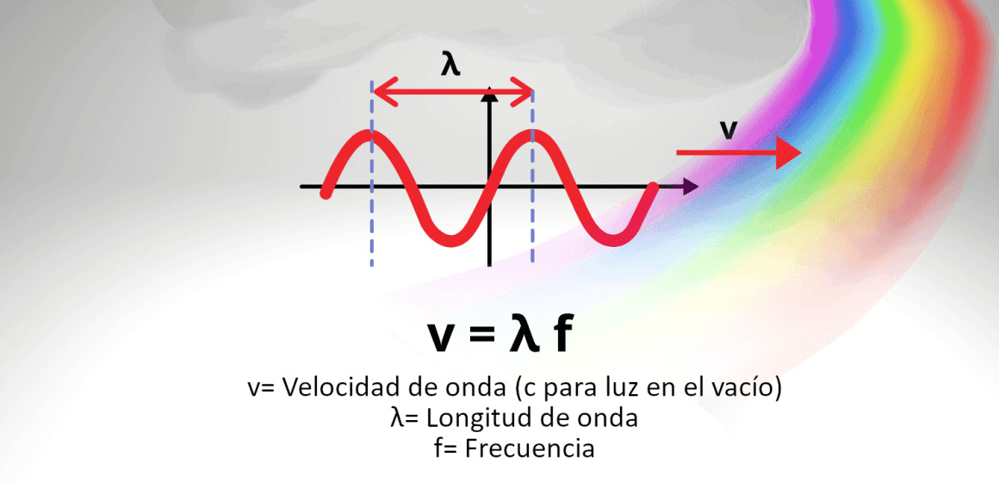
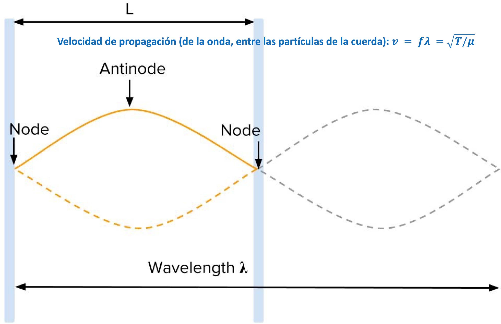
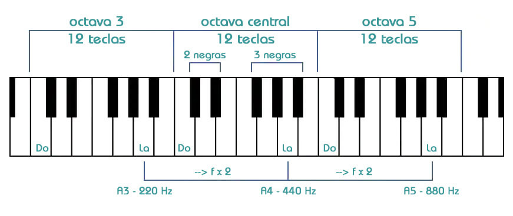
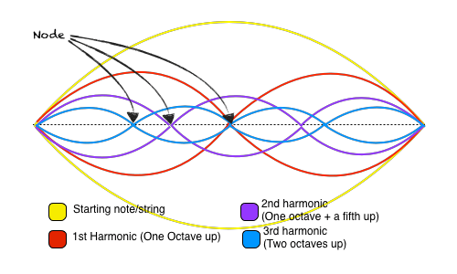

{}
Entrada basada en el siguiente hilo de Twitter:



{}

La música es un lenguaje universal. Una pieza de piano, una canción de rock o una banda sonora nos emociona y nos transporta a otro mundo. Sin quitarle esa magia, veamos la ciencia que hay detrás. Hablaremos de [**cuerdas**](https://es.wikipedia.org/wiki/Cuerda_vibrante), [**notas musicales**](https://es.wikipedia.org/wiki/Nota_(sonido))[^1], [**armónicos**](https://es.wikipedia.org/wiki/Armónico), [**acordes**](https://es.wikipedia.org/wiki/Acorde)...

[^1]: Aunque se salga de la física, me parece curioso de dónde vienen los nombres de las notas: salvo el *Do*, que apareció después, las introdujo [Guido de Arezzo](https://es.wikipedia.org/wiki/Guido_de_Arezzo) en este himno dedicado a San Juan, ¡del año 1026!
  . Fuente: https://microsonus.com/biblioteca-musical/microseries/fundamentos-del-sonido/fundamentos-notas-frecuencias/.")

Empecemos con una cuerda de longitud *L* sujeta por ambos extremos. Si la hacemos vibrar, oiremos un sonido. El parámetro que nos dice lo agudo o grave que será es su [**frecuencia**](https://es.wikipedia.org/wiki/Frecuencia). Para cualquier onda podemos relacionar la velocidad de propagación con su frecuencia y su [**longitud de onda**](https://es.wikipedia.org/wiki/Longitud_de_onda).

Cuando tocamos una cuerda sujeta por ambos extremos, su longitud de onda es dos veces la longitud. ¿Y su velocidad? La que nos interesa no es la de las partículas de la cuerda moviéndose arriba y abajo sino la de propagación de la onda a través de la cuerda. Esta depende de la [**tensión**](https://es.wikipedia.org/wiki/Tensión_(mecánica)) de la cuerda (*T*) y de su [**densidad lineal** (µ)](https://es.wikipedia.org/wiki/Densidad_lineal).

¿Cómo llega el sonido a nuestro oído? A través de las moléculas de aire que hay entre el instrumento y nosotros; el instrumento las hace vibrar a la frecuencia a la que está siendo tocado y esa vibración (no las moléculas en sí) se propaga hacia nosotros longitudinalmente. 

<figure>

<a href="https://tenor.com/view/sound-wave-gif-25371774">Sound Wave GIF</a>from <a href="https://tenor.com/search/sound+wave-gifs">Sound Wave GIFs</a>
 
<figcaption>Vibración de las moléculas de gas cuando se genera sonido en un <a href="https://es.wikipedia.org/wiki/Diapasón" rel="noopener"><strong>diapasón</strong></a>. Ojo, aunque pueda parecer, las moléculas no se mueven hacia nosotros (eso sería viento), sino que se transmite su vibración a través de ellas, creando patrones de <a href="https://es.wikipedia.org/wiki/Compresión_(f%C3%ADsica)" rel="noopener"><strong>compresión</strong></a> y <a href="https://es.wikipedia.org/wiki/Rarefacción" rel="noopener"><strong>rarefacción</strong></a>. Es decir, lo que se mueve es la onda, no las partículas.</figcaption>
</figure>

Con la ecuación de debajo vemos que cuanto más larga es la cuerda, más grave sonará (menor *f*). En una guitarra, todas las cuerdas tienen la misma longitud, pero su grosor (es decir, su diámetro) es distinto. Cuerdas con mayor diámetro dan lugar a una nota de base más grave.

<figure>
$$f = \frac{1}{2L}\sqrt{\frac{T}{\mu}};\quad \mu = \frac{\rho \pi d^2}{4}$$
<figcaption>La frecuencia de vibración de la cuerda depende de su longitud (<em>L</em>), la tensión a la que está sometida (<em>T</em>) y su densidad lineal (<em>µ</em>), esta última proporcional a la densidad y al cuadrado del diámetro de la cuerda (<em>d</em>). Es decir, la frecuencia es inversamente proporcional al diámetro de la cuerda, lo cual se aprovecha en las guitarras y en otros instrumentos de cuerda para que cuerdas del mismo material y de la misma longitud den lugar a notas distintas.</figcaption>
</figure>

Otro parámetro importante de la ecuación para la música es la tensión. Cuando afinas una guitarra o un bajo ajustando sus clavijas, modificas ligeramente su tensión (*T*). Por la ecuación anterior, eso se traduce en un ligero cambio en la frecuencia a la que suena. Con ello, logramos que las notas que queremos tocar estén en su frecuencia precisa.

. El sonido más grave lo haremos si tocamos sin poner ningún dedo. Al ponerlo, acortamos la longitud que vibra. Editada de https://gollihurmusic.com/what-are-the-frequencies-of-bass-notes/.")

¿Cuál es esa frecuencia precisa? Las orquestas actuales afinan sus instrumentos a 440&thinsp;Hz, correspondientes al cuarto La (A). A partir de ahí, el resto de notas de la octava se obtienen [multiplicando (+ agudo) o dividiendo (+ grave) *f* por 21/12 &asymp; 1.06 sucesivamente](https://www.fceia.unr.edu.ar/prodivoz/tp1_01.html).

| Nota | Frecuencia (Hz) |
| --- | --- |
| La | 440 |
| La♯ - Si♭ | 440 &times; 21/12 |
| Si | 440 &times; 22/12 |
| Do | 440 &times; 23/12 |
| Do♯ - Re♭ | 440 &times; 24/12 |
| Re | 440 &times; 25/12 |
| Re♯ - Mi♭ | 440 &times; 26/12 |
| Mi | 440 &times; 27/12 |
| Fa | 440 &times; 28/12 |
| Fa♯ - Sol♭ | 440 &times; 29/12 |
| Sol | 440 &times; 210/12 |
| Sol♯ - La♭ | 440 &times; 211/12 |
| La | 440 &times; 212/12 = 880 |

Multiplicar por 1.06 es la forma de dividir exactamente las 12 notas[^2] que hay hasta llegar al siguiente La y que éste se encuentre al doble de frecuencia. Nuestro oído reconoce ese segundo armónico, la onda vibrando al doble de frecuencia, como la misma nota, pero más aguda.

[^2]: El sistema de afinación que utilizamos para dividir la octava en 12 partes iguales (12 notas musicales, técnicamente semitonos temperados) se denomina [temperamento igual](https://es.wikipedia.org/wiki/Temperamento_igual). Aunque existen otros sistemas con distinto número de notas por octava, como el de 24 de la música árabe, el temperamento igual es el sistema de afinación más utilizado actualmente en la música occidental.

Sin embargo, falta algo para completar esta explicación. En este vídeo podéis oír una onda de sonido <<puramente>> de 440&thinsp;Hz (sinusoidal). Una guitarra o un piano reproducen mucho más que esto cuando tocan un La de cuarta octava...



En realidad, cuando tocamos una cuerda, esta no solo vibra con el modo fundamental, correspondiente p. ej. a 440&thinsp;Hz en el ejemplo anterior; hay otras soluciones de frecuencia superior que cumplen las condiciones de contorno de una cuerda sujeta por ambos extremos. Aquí veis los 8 primeros armónicos de dicha cuerda (vía [@Rayleighlord](https://twitter.com/rayleighlord)). 



Si os fijáis en la animación anterior, esos armónicos superiores que acompañan en menor intensidad al fundamental al tocar la cuerda corresponden al doble, al triple, etc. de frecuencia. La mayoría (2*f*, 4*f*, 8*f*, ...) por sí solas las reconoceríamos como la misma nota más aguda. Luego veremos qué ocurre con algunos otros armónicos como el tercero.

En resumen, cuanto tocas el cuarto La en un piano o en una guitarra, no solo tocas p. ej. 440&thinsp;Hz, sino también su 2.° armónico (880&thinsp;Hz), su 3.º etc. que, sumados, nos dan su sonido. Distintos instrumentos dan distinto peso a unos armónicos respecto a otros.

 (*tuning fork* en inglés) únicamente suena a la frecuencia fundamental mientras que en el resto de instrumentos la nota que escuchamos es en realidad una suma ponderada de la frecuencia fundamental + múltiplos enteros de ellas, conocidos como [**armónicos**](https://es.wikipedia.org/wiki/Armónico). En música, la combinación de armónicos de cada instrumento se conoce como [**timbre**](https://es.wikipedia.org/wiki/Timbre_(acústica)) mientras que, en física, la descomposición de un sonido en sus frecuencias es parte del llamado [**análisis de Fourier**](https://es.wikipedia.org/wiki/Análisis_de_Fourier). Fuente: https://slideplayer.com/slide/14637473/.")

Recíprocamente, si a un extremo de una cuerda lo hacemos vibrar a su frecuencia fundamental (*n* = 1) o a alguno de sus armónicos (*n* = 2, ...), la cuerda vibra fuerte con su longitud de onda correspondiente (resonancia). Cualquier otra frecuencia es menos efectiva.

El peso de los armónicos también determina el tono de nuestra voz. Si canto y te pido imitar mi <<La>> el tuyo sonará distinto al mío. Aquí podéis ver la descomposición en frecuencias de distintos cantantes:



Terminemos la entrada hablando de las [**quintas**](https://es.wikipedia.org/wiki/Quinta). Hemos visto en la imagen de los armónicos que el tercer armónico de una cuerda no es la nota fundamental más aguda. Sin embargo, tiene una relación muy especial con ella, conocida como su ***quinta justa***. En la imagen veis un ejemplo donde para el Do (C) su quinta justa es el Sol (G). La relación matemática subyacente también tiene implicaciones musicales.



La mayoría de acordes están compuestos de la primera nota (definida por el acorde), su quinta justa y (salvo un [***power chord***](https://es.wikipedia.org/wiki/Power_chord)) alguna nota más. Veamos un ejemplo. El acorde de Do mayor se compone de las notas Do-Mi-Sol mientras que el de Do menor es Do-Mi♭-Sol. Ambas notas encajan bien porque una quinta justa (en este ejemplo, Sol) tiene una relación de frecuencias factor 3:2 con la nota fundamental del acorde (en este ejemplo, Do).

| | Fundamental | Tercera | Quinta justa |
| :-: | :-: | :-: | :-: |
| Acorde de quinta de Do | Do |  | Sol |
| Acorde mayor de Do | Do | Mi | Sol |
| Acorde menor de Do | Do | Mi♭ | Sol |

Esquematizado con la vibración de una cuerda, se ve así. Una relación de 3:2 de frecuencias con la nota principal es equivalente a una relación de 2:3 de longitudes de onda, pues la velocidad de propagación es la del sonido en el aire (343.2&thinsp;m/s a temperatura ambiente) en ambos casos. La relación entre armónicos es la base de un acorde y, como veremos debajo, también relaciona acordes.



Quienes seáis músicos y estéis leyendo esto quizá sabréis qué es el [**círculo de quintas**](https://es.wikipedia.org/wiki/C%C3%ADrculo_de_quintas): un esquema de las distintas tonalidades, separadas por (cómo no) la llamada ***quinta justa***. De ahí que Sol (G) esté al lado de Do (C). También ayuda a componer canciones con buenas combinaciones de acordes.

Muchas canciones de pop combinan C, G, Am y F (p. ej. [*Hello*](https://es.wikipedia.org/wiki/Hello_(canción_de_Adele)) o [*Despacito*](https://es.wikipedia.org/wiki/Despacito)[^3]); aprovechan el accesible sonido de la quinta justa, pasando entre acordes vecinos del círculo de quintas. Hay mucho más, se lo dejo a un divulgador musical, pero son buenos ejemplos de la potencia de la relación de frecuencias.

[^3]: Despacito usa los mismos acordes (IV, IV, I, V) en otra tonalidad (F♯m: F♯m, A, E, D), de nuevo saltando entre vecinos del círculo de quintas, como podéis ver en la imagen. Aparte de que los acordes se forman con la primera y su quinta justa, como hemos visto antes, las transiciones de acordes de quinta justa se dan en los ejemplos entre el I (C o A), el V (G o E) y de nuevo entre el IV (F o D) y el I (C o A).
  

Con esto termina una entrada que, como físico y amante de la música, me ha hecho especial ilusión preparar. Espero que lo hayáis disfrutado y hayáis aprendido algo de música, de física o de la relación entre ambas.

{}
Si te ha gustado esta entrada, te recomiendo este vídeo de [@Lemnismath](https://twitter.com/lemnismath), donde se profundiza en la formación de escalas a partir de octavas y quintas, explicado de forma muy sencilla y con animaciones muy buenas:

{}