{}
En esta entrada mostramos un breve **resumen** de la **información** que se encuentra en la excelente [**página oficial** de los **Objetivos de Desarrollo Sostenible (ODS)** de las **Naciones Unidades**](https://www.un.org/sustainabledevelopment/es/sustainable-development-goals/), donde puedes encontrar además **datos destacables** y **metas** de cada uno de los **objetivos**. También puedes echar un vistazo a la [**Guía** de los **vagos** para **salvar** el **mundo**](https://www.un.org/sustainabledevelopment/es/takeaction/) (descargable en PDF en el botón de arriba) donde nos recomiendan **acciones** que podemos llevar a cabo para **obtener resultados** y poner así nuestro granito de arena.
{}

{}

Los [**Objetivos de Desarrollo Sostenible (ODS)**](https://es.wikipedia.org/wiki/Objetivos_de_Desarrollo_Sostenible) son un conjunto de 17 objetivos globales interconectados diseñados para ser un *plan para lograr un futuro mejor y más sostenible para todos*. Los ODS fueron establecidos en 2015 por la [Asamblea General de las Naciones Unidas](https://es.wikipedia.org/wiki/Asamblea_General_de_las_Naciones_Unidas) y están incluidos en la resolución que se conoce como **Agenda 2030**, año para el cual se pretende alcanzarlos.



## 1. Fin de la pobreza

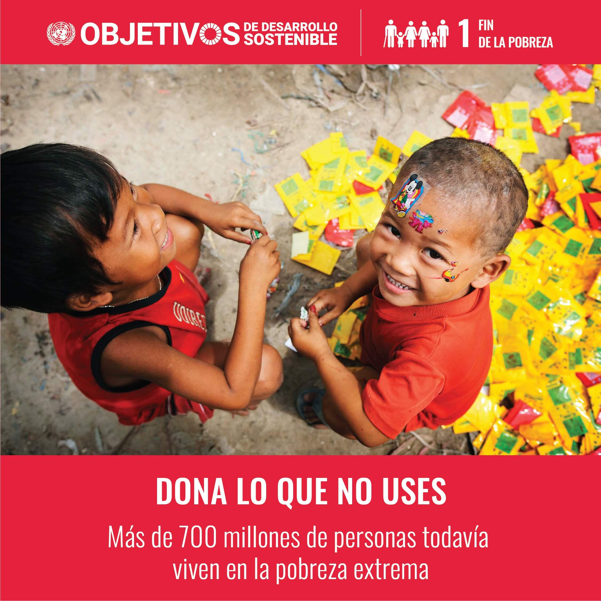

Para lograr este Objetivo de acabar con la pobreza, el crecimiento económico debe ser inclusivo, con el fin de crear empleos sostenibles y de promover la igualdad.

{}
Pincha [aquí](https://www.un.org/sustainabledevelopment/es/wp-content/uploads/sites/3/2016/10/1_Spanish_Why_it_Matters.pdf) para descubrir **por qué es importante** este **ODS**.
{}

## 2. Hambre cero

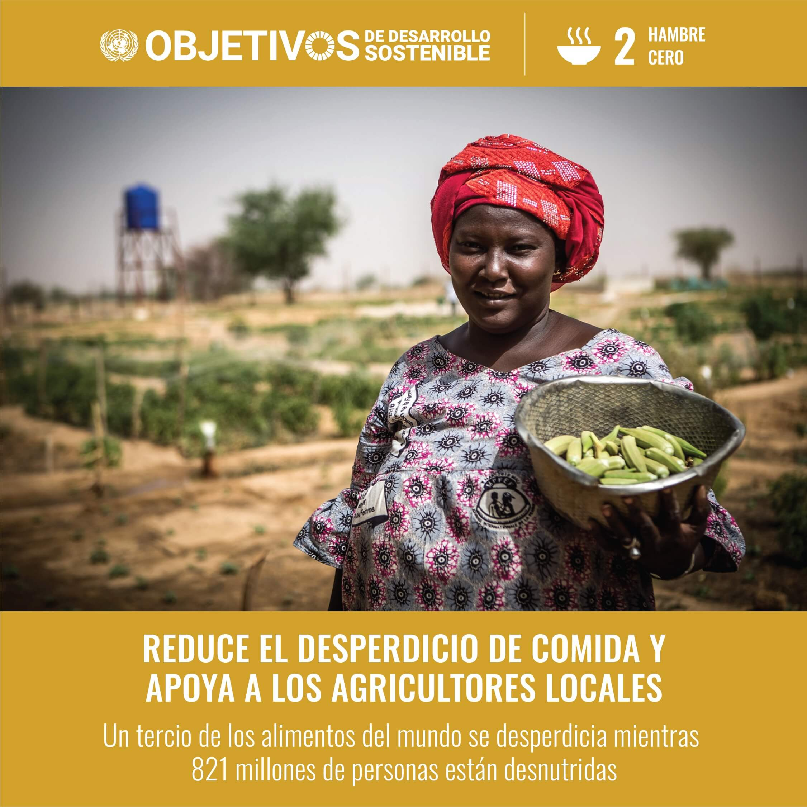

El sector alimentario y el sector agrícola ofrecen soluciones claves para el desarrollo y son vitales para la eliminación del hambre y la pobreza.

{}
Pincha [aquí](https://www.un.org/sustainabledevelopment/es/wp-content/uploads/sites/3/2016/10/2_Spanish_Why_it_Matters.pdf) para descubrir **por qué es importante** este **ODS**.
{}

## 3. Salud y bienestar

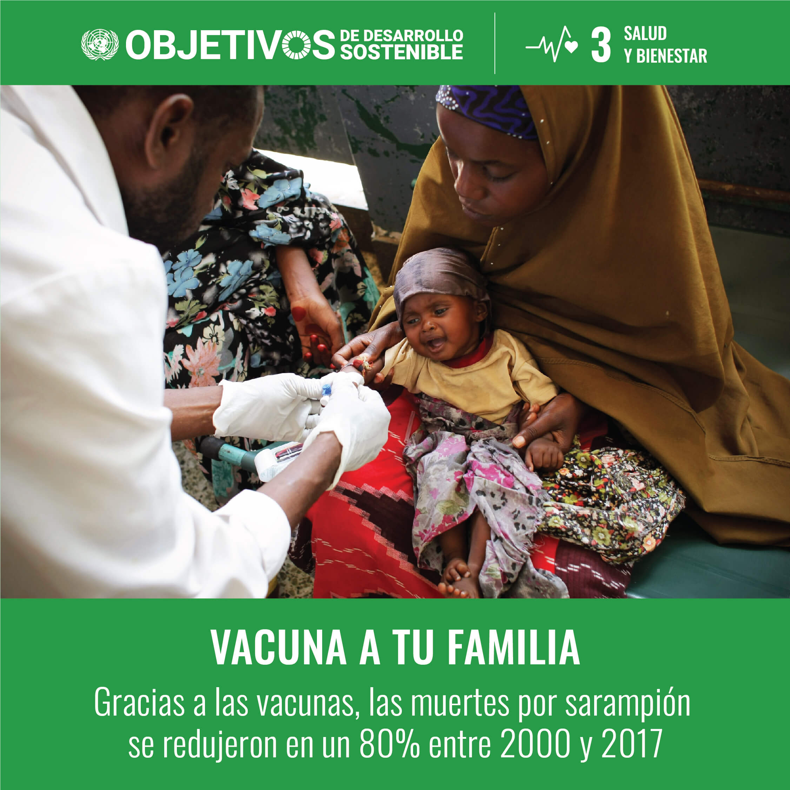

Para lograr los Objetivos de Desarrollo Sostenible, es fundamental garantizar una vida saludable y promover el bienestar universal.

{}
Pincha [aquí](https://www.un.org/sustainabledevelopment/es/wp-content/uploads/sites/3/2016/10/3_Spanish_Why_it_Matters.pdf) para descubrir **por qué es importante** este **ODS**.
{}

## 4. Educación de calidad

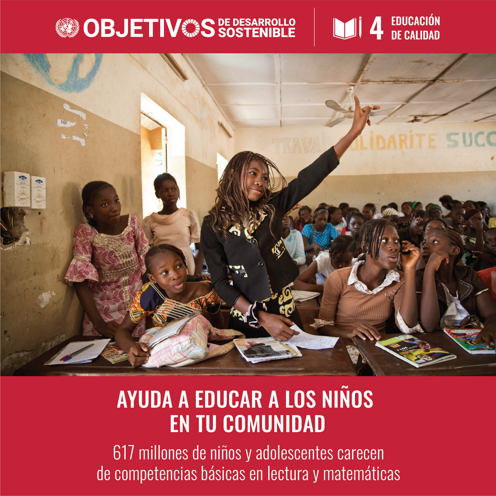

La educación es la base para mejorar nuestra vida y el desarrollo sostenible.

{}
Pincha [aquí](https://www.un.org/sustainabledevelopment/es/wp-content/uploads/sites/3/2016/10/4_Spanish_Why_it_Matters.pdf) para descubrir **por qué es importante** este **ODS**.
{}

## 5. Igualdad de género

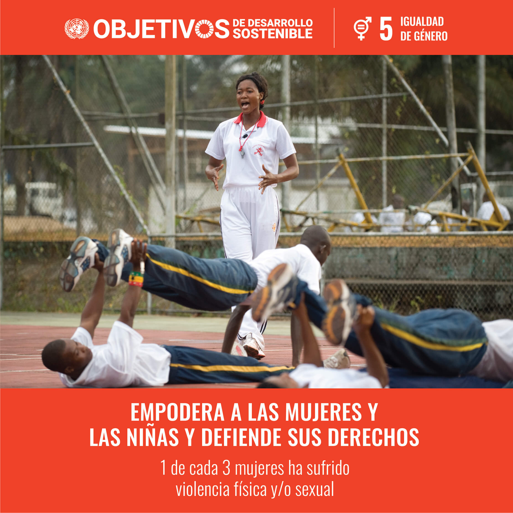

La [**igualdad entre** los **géneros**](https://www.un.org/sustainabledevelopment/es/ending-violence-against-women-and-girls/) no es solo un derecho humano fundamental, sino la base necesaria para conseguir un mundo pacífico, próspero y sostenible.

{}
Pincha [aquí](https://www.un.org/sustainabledevelopment/es/wp-content/uploads/sites/3/2016/10/5_Spanish_Why_it_Matters.pdf) para descubrir **por qué es importante** este **ODS**.
{}

## 6. Agua limpia y saneamiento

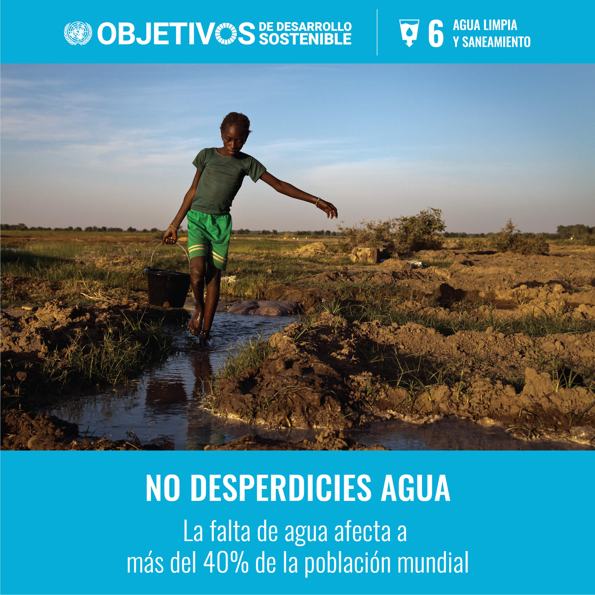

El [agua](https://www.un.org/es/observances/water-day/) libre de impurezas y accesible para todos es parte esencial del mundo en que queremos vivir.

{}
Pincha [aquí](https://www.un.org/sustainabledevelopment/es/wp-content/uploads/sites/3/2016/10/6_Spanish_Why_it_Matters.pdf) para descubrir **por qué es importante** este **ODS**.
{}

## 7. Energía asequible y no contaminante

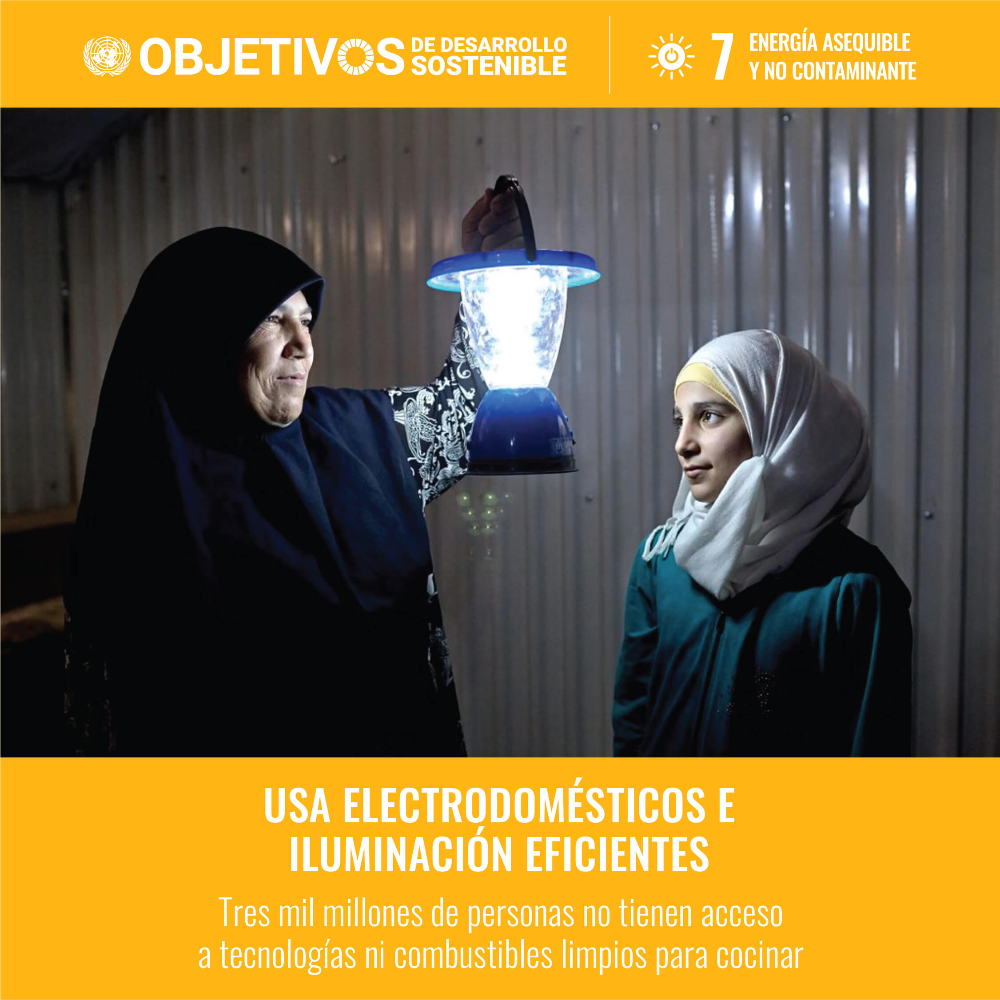

La energía es central para casi todos los grandes desafíos y oportunidades a los que se enfrenta el mundo en la actualidad.

{}
Pincha [aquí](https://www.un.org/sustainabledevelopment/es/wp-content/uploads/sites/3/2016/10/7_Spanish_Why_it_Matters.pdf) para descubrir **por qué es importante** este **ODS**.
{}

## 8. Trabajo decente y crecimiento económico

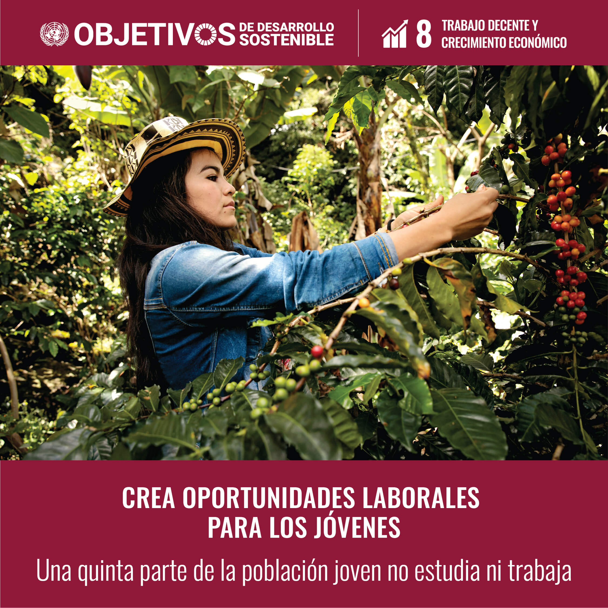

Debemos reflexionar sobre este progreso lento y desigual, y revisar nuestras políticas económicas y sociales destinadas a erradicar la pobreza.

{}
Pincha [aquí](https://www.un.org/sustainabledevelopment/es/wp-content/uploads/sites/3/2016/10/8_Spanish_Why_it_Matters.pdf) para descubrir **por qué es importante** este **ODS**.
{}

## 9. Industria, innovación e infraestructura

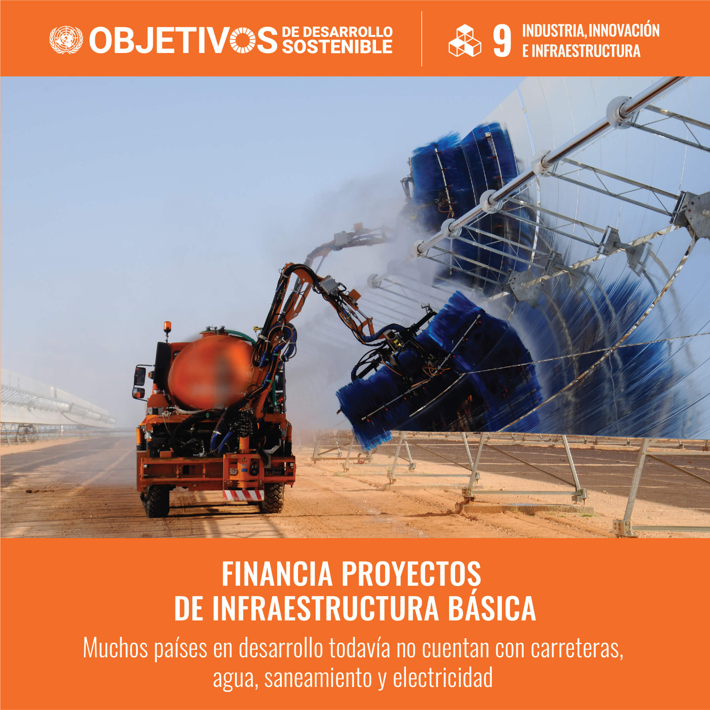

Las inversiones en infraestructura son fundamentales para lograr un desarrollo sostenible.

{}
Pincha [aquí](https://www.un.org/sustainabledevelopment/es/wp-content/uploads/sites/3/2016/10/9_Spanish_Why_it_Matters.pdf) para descubrir **por qué es importante** este **ODS**.
{}

## 10. Reducción de las desigualdades

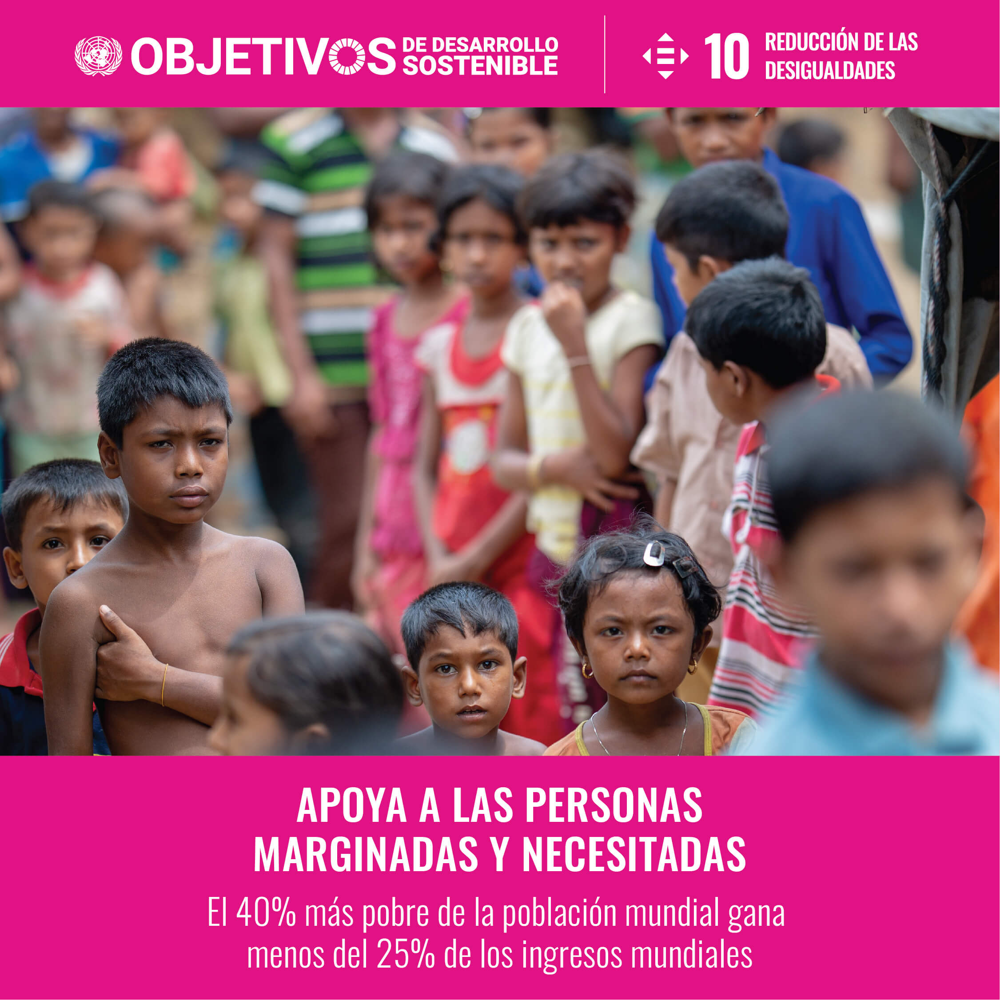

Reducir la desigualdad en y entre los países.

{}
Pincha [aquí](https://www.un.org/sustainabledevelopment/es/wp-content/uploads/sites/3/2016/10/10_Spanish_Why_it_Matters.pdf) para descubrir **por qué es importante** este **ODS**.
{}

## 11. Ciudades y comunidades sostenibles

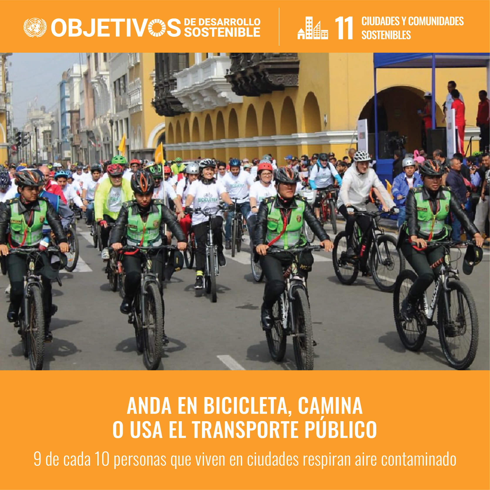

Las inversiones en infraestructura son cruciales para lograr el desarrollo sostenible.

{}
Pincha [aquí](https://www.un.org/sustainabledevelopment/es/wp-content/uploads/sites/3/2016/10/11_Spanish_Why_it_Matters.pdf) para descubrir **por qué es importante** este **ODS**.
{}

## 12. Producción y consumo responsables

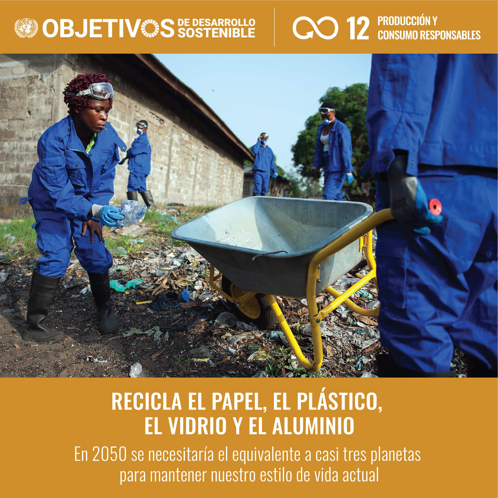

El objetivo del consumo y la producción sostenibles es hacer más y mejores cosas con menos recursos.

{}
Pincha [aquí](https://www.un.org/sustainabledevelopment/es/wp-content/uploads/sites/3/2016/10/12_Spanish_Why_it_Matters.pdf) para descubrir **por qué es importante** este **ODS**.
{}

## 13. Acción por el clima

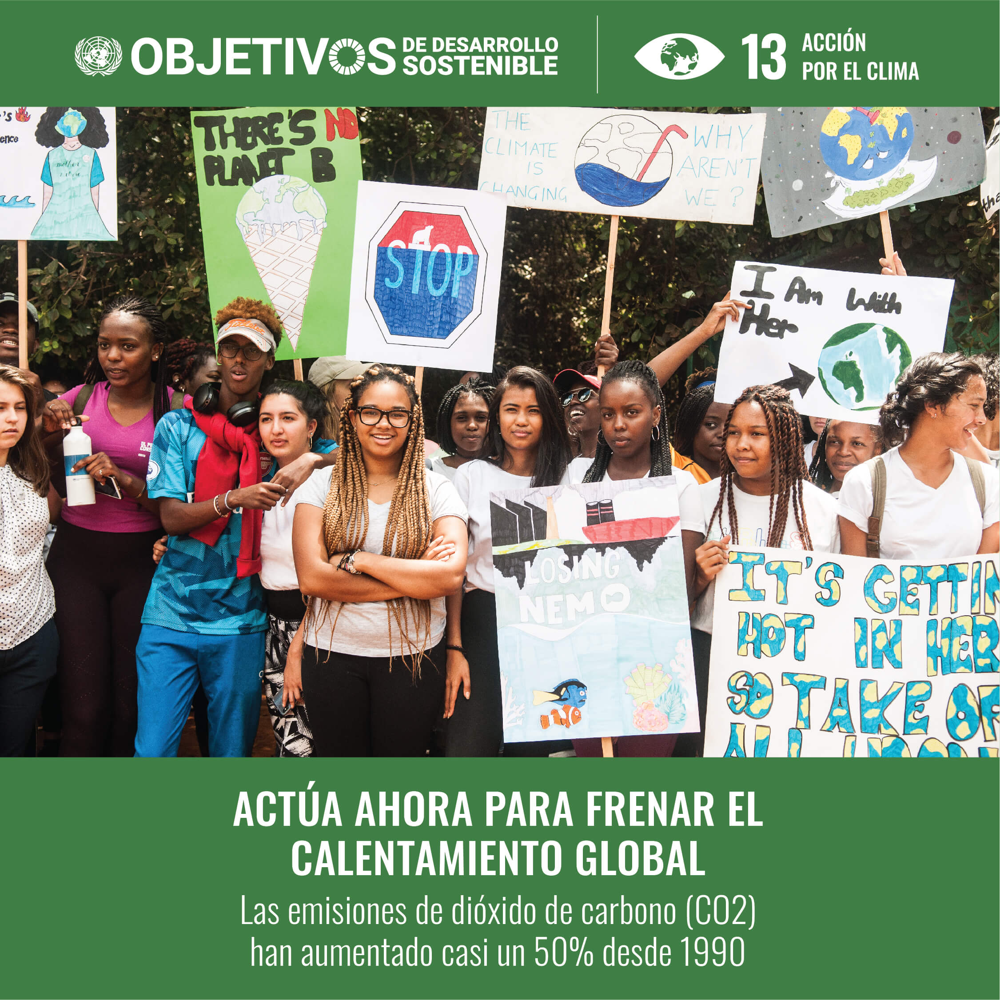

El [**cambio climático**](https://www.un.org/sustainabledevelopment/es/climate-action/) es un reto global que no respeta las fronteras nacionales.

{}
Pincha [aquí](https://www.un.org/sustainabledevelopment/es/wp-content/uploads/sites/3/2016/10/13-Spanish_Why-it-Matters.pdf) para descubrir **por qué es importante** este **ODS**.
{}

## 14. Vida submarina

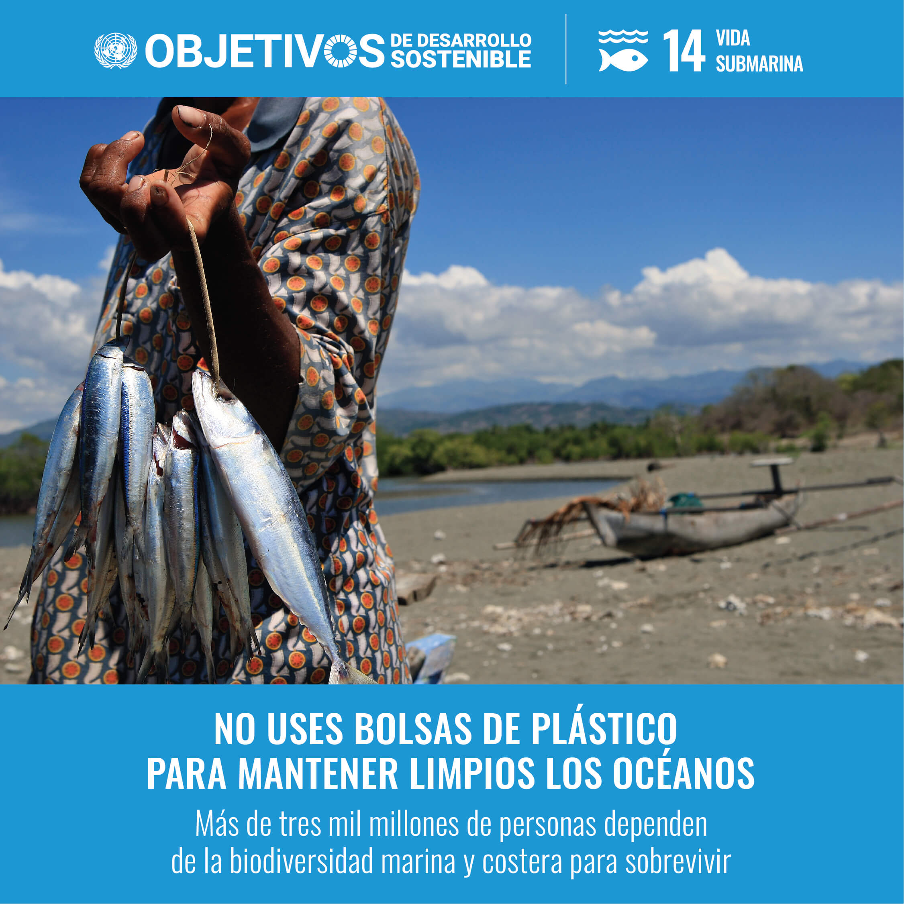

Conservar y utilizar en forma sostenible los [**océanos**](https://www.un.org/es/conferences/ocean2022), los mares y los recursos marinos para el desarrollo sostenible.

{}
Pincha [aquí](https://www.un.org/sustainabledevelopment/es/wp-content/uploads/sites/3/2016/10/14_Spanish_Why_it_Matters.pdf) para descubrir **por qué es importante** este **ODS**.
{}

## 15. Vida de ecosistemas terrestres

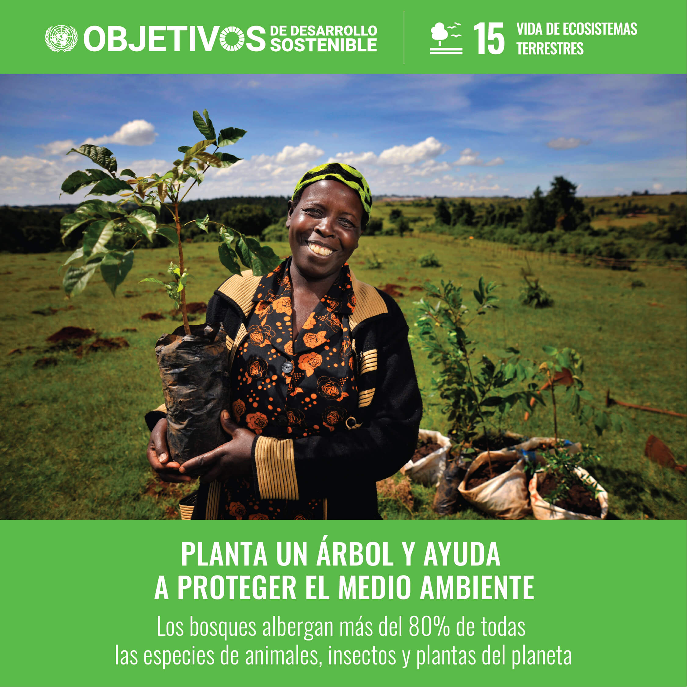

Gestionar sosteniblemente los bosques, luchar contra la desertificación, detener e invertir la degradación de las tierras y detener la pérdida de biodiversidad.

{}
Pincha [aquí](https://www.un.org/sustainabledevelopment/es/wp-content/uploads/sites/3/2016/10/15_Spanish_Why_it_Matters.pdf) para descubrir **por qué es importante** este **ODS**.
{}

## 16. Paz, justicia e instituciones sólidas

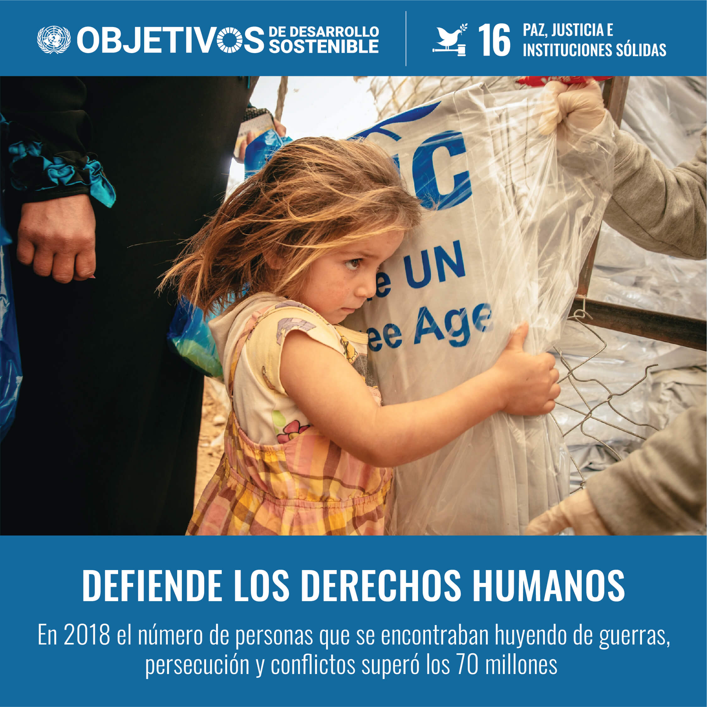

Acceso universal a la justicia y la construcción de instituciones responsables y eficaces a todos los niveles.

{}
Pincha [aquí](https://www.un.org/sustainabledevelopment/es/wp-content/uploads/sites/3/2017/01/Goal_16_Spanish.pdf) para descubrir **por qué es importante** este **ODS**.
{}

## 17. Alianzas para lograr los objetivos

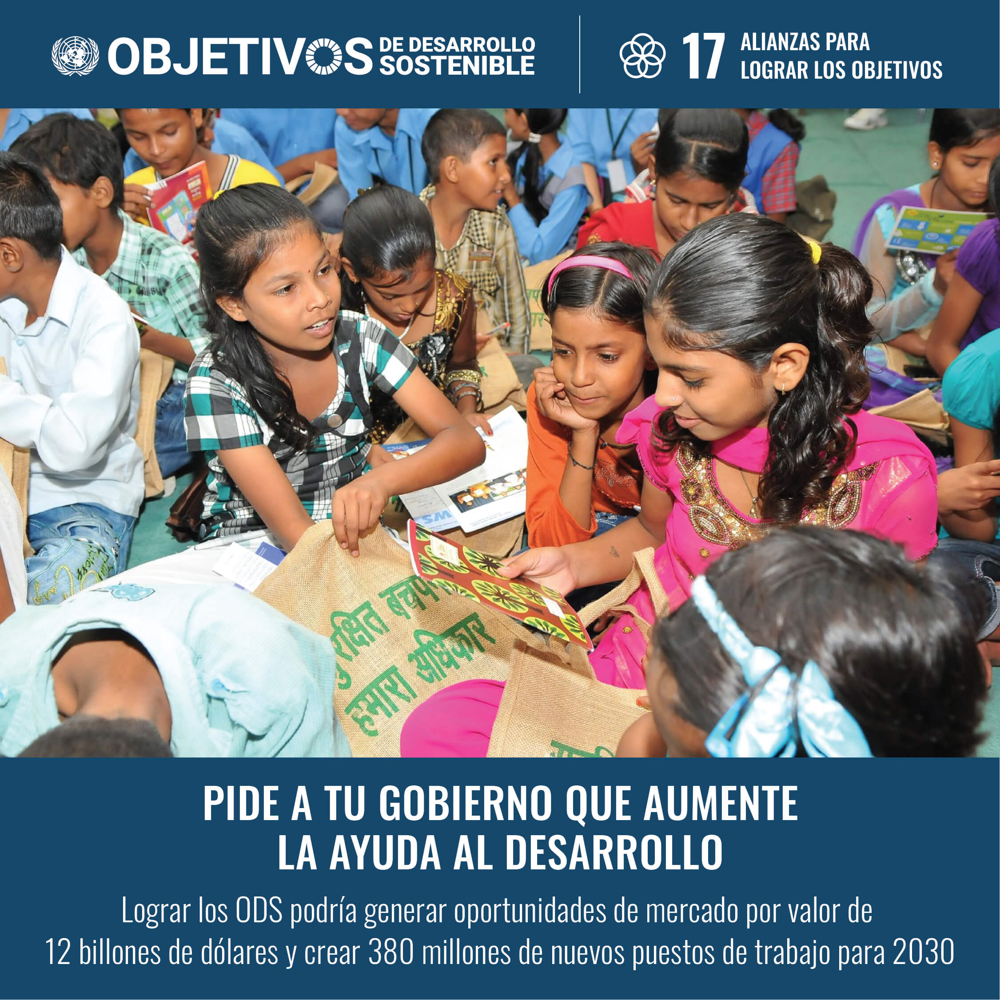

Revitalizar la Alianza Mundial para el Desarrollo Sostenible.

{}
Pincha [aquí](https://www.un.org/sustainabledevelopment/es/wp-content/uploads/sites/3/2016/10/17_Spanish_Why_it_Matters.pdf) para descubrir **por qué es importante** este **ODS**.
{}