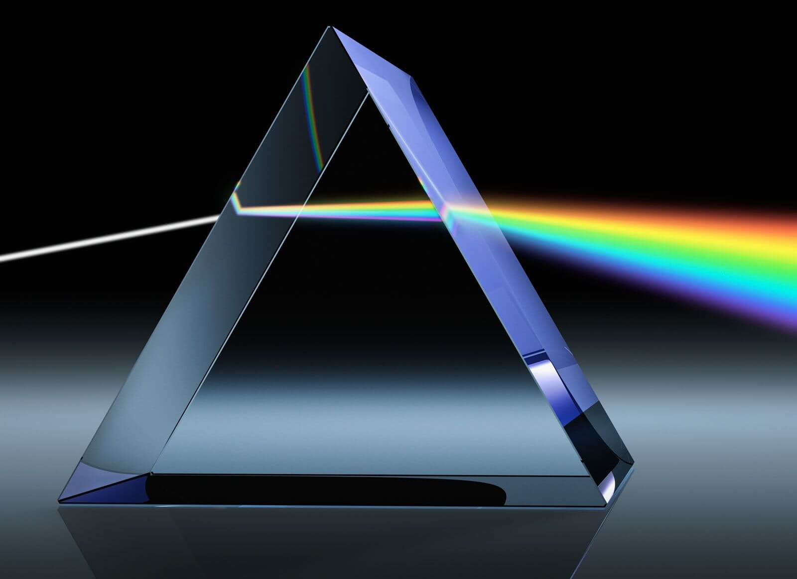
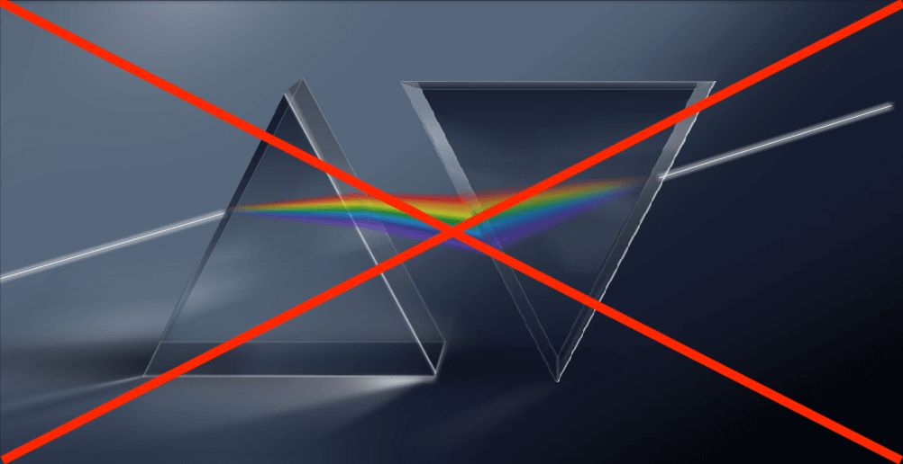
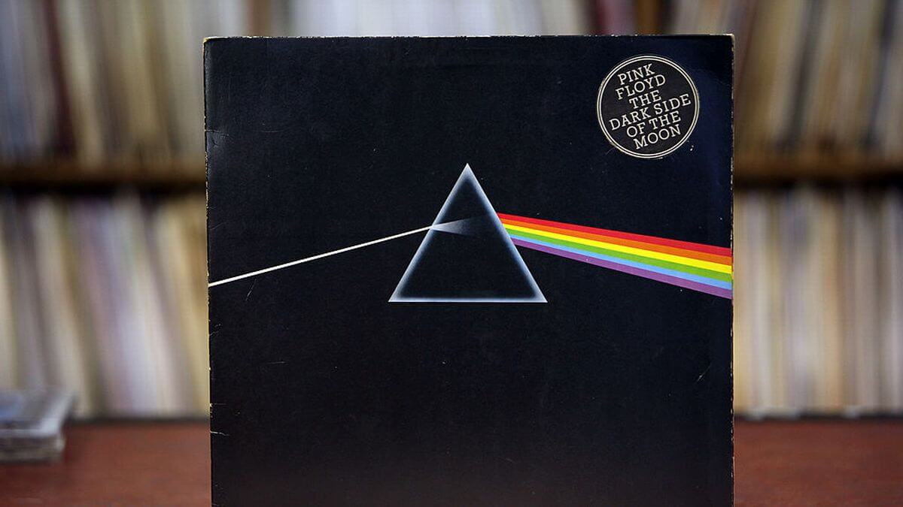

{}
Entrada basada en el siguiente hilo de Twitter:



{}

El pasado 1 de marzo, el mítico disco ["*The Dark Side of the Moon*"](https://es.wikipedia.org/wiki/The_Dark_Side_of_the_Moon), de [Pink Floyd](https://es.wikipedia.org/wiki/Pink_Floyd), cumplió 50 años. En su icónica portada vemos un experimento clave de la física: un [**prisma**](https://es.wikipedia.org/wiki/Prisma_(óptica)) que descompone un rayo de luz blanca en los colores del [arcoíris](). ¿Y si te dijera que, físicamente, algo falla?

Empecemos con un [haz monocromático](https://es.wikipedia.org/wiki/Luz_monocromática) (de “*un único color*”). Al entrar en el prisma de vidrio, el haz se desvía. ¿Por qué? Sin entrar en detalles, pensad que la luz es radiación electromagnética (EM) visible y en el vidrio hay cargas móviles que también emiten radiación EM.

<iframe src="https://phet.colorado.edu/sims/html/bending-light/latest/bending-light_es.html"
        width="100%"
        height="600"
        allowfullscreen>
</iframe>

Iluminemos ahora el prisma con luz blanca, como hiciera entre 1670 y 1672 [Newton](https://es.wikipedia.org/wiki/Isaac_Newton) para explicar su revolucionaria teoría del color. La dispersión en colores de la luz blanca refractada en el prisma ya le reveló que la luz blanca se compone de todos los colores del arcoíris.

El [índice de refracción](https://es.wikipedia.org/wiki/Índice_de_refracción), de 1.5 en el prisma, cuantifica cuánto se desvía el haz de luz blanco incidente, a partir de la [ley de Snell](https://es.wikipedia.org/wiki/Ley_de_Snell). Haciendo cálculos, se obtiene, por ejemplo, un ángulo de refracción β = 28° para α = 45°. Entonces, ¿acaso se desvía toda la luz blanca exactamente ese mismo ángulo?



Según la portada de Pink Floyd, habría dispersión de ángulos en la luz blanca, es decir, no toda se desviaría el mismo ángulo, pero veríamos luz blanca dentro del prisma. Sería al salir cuando se produciría la dispersión en colores. Ya aviso que la portada es irreprochable artísticamente, pero, físicamente, no es correcta.



En realidad, los distintos colores que forman la luz blanca ya se observan dentro del vidrio. Es decir, experimentalmente vemos que la luz no solo se desvía de su trayectoria inicial un cierto ángulo dado por el índice de refracción, sino que esa desviación es distinta según su longitud de onda.

Hablar de longitud de onda, a grandes rasgos, es como hablar de color. [Como vimos en la entrada sobre el cielo azul](), nuestros ojos detectan aquellas ondas electromagnéticas con longitudes de onda en el aire de la imagen y, para distinguir entre ellas, nuestro cerebro les asigna distintos colores.



Esto indica que el índice de refracción del vidrio debe ser ligeramente distinto para cada uno de los colores, es decir, de las longitudes de onda. Si fuera igual para todas, no habría dispersión y solo veríamos un rayo blanco dentro del prisma. Y así es.

<table id="colores-resistencias" class="table">
<caption style="color: #2E3440">Tabla que muestra el índice de refracción de un tipo de vidrio común (<a href="https://es.wikipedia.org/wiki/Vidrio_crown" target="_blank" rel="noopener"><em>crown</em></a>) dependiendo de la longitud de onda. El índice de refracción es mayor según la longitud de onda es menor (es decir, hacia el violeta), lo que hace que el violeta se desvíe más que el azul, el azul más que el amarillo, etc., dando lugar al patrón de colores característico del prisma. Adaptada de <a href="http://cs-fs-primero.blogspot.com/2015/06/refraccion-velocidad-de-la-luz-y.html" target="_blank" rel="noopener">http://cs-fs-primero.blogspot.com/2015/06/refraccion-velocidad-de-la-luz-y.html</a>.</caption>
<thead>
<tr>
<th class="text-center" colspan=2>Color</th>
<th class="text-center">Velocidad</th>
<th class="text-center">Índice de refracción</th>
</tr>
<tr>
<th class="text-center">Longitud de onda</th>
<th class="text-center">Sensación visual</th>
<th class="text-center">km/s</th>
<th class="text-center">n</th>
</tr>
</thead>
<tbody>
<tr style="background-color:red">
<td align="center">670.6</td>
<td align="center">Rojo</td>
<td align="center">198&thinsp;144</td>
<td align="center">1.5130</td>
</tr>
<tr style="background-color:yellow">
<td align="center">589.3</td>
<td align="center">Amarillo</td>
<td align="center">197&thinsp;622</td>
<td align="center">1.5170</td>
</tr>
<tr style="background-color:cyan">
<td align="center">486.4</td>
<td align="center">Cian</td>
<td align="center">196&thinsp;199</td>
<td align="center">1.5280</td>
</tr>
<tr style="background-color:violet">
<td align="center">404.7</td>
<td align="center">Violeta</td>
<td align="center">195&thinsp;687</td>
<td align="center">1.5320</td>
</tr>
</tbody>
</table>

Cuando la luz blanca llega al prisma, la parte roja se ve ligeramente menos desviada que la violeta, lo cual se ve tanto dentro como al salir del prisma. Newton entonces colocó un segundo prisma, invertido. Aquí tenemos que desmentir un bulo; no se recupera la luz blanca.

Como se muestra en este diagrama + experimento de A. del Mazo, S. Velasco y R. García-Molina, el rayo de luz, originalmente blanco, que emerge del segundo prisma, sigue dispersado en los colores del arcoíris. La clave de que los colores no se reagrupen tras el segundo prisma es que los rayos no salen del primero paralelos entre sí, sino divergentes. Hay opciones más elaboradas con las que Newton ya experimentó, como la colocación de una lente biconvexa simétrica entre ambos prismas, que sí reconstruyen la luz blanca (como en la [figura 13 del magnífico artículo de Alejandro del Mazo Vivar, Santiago Velasco Maíllo y Rafael García-Molina de 2020 en la revista Eureka](https://revistas.uca.es/index.php/eureka/article/view/5776/6612)).

.")

Newton concluyó que el color es una propiedad intrínseca de la luz, la cual estaría formada por partículas. Poco después, [Huygens](https://es.wikipedia.org/wiki/Christiaan_Huygens) desarrollaría la [teoría ondulatoria de la luz](https://es.wikipedia.org/wiki/Luz#Teoría_ondulatoria). Ambos iniciaron un [ácido debate sobre la naturaleza de la luz](http://rsefalicante.umh.es/TemasLuz/Luz03.htm), el cual siguió estando en el centro de la física durante siglos. Si queréis saber más sobre la comprensión histórica y actual de la naturaleza de la luz, recomiendo encarecidamente este vídeo de QuantumFracture:



Volviendo al prisma y a la portada del "*The Dark Side of the Moon*", si quisiéramos que ésta fuese físicamente verídica, deberíamos ver la separación en colores ya dentro del prisma en vez de únicamente fuera de él. Artísticamente está perfecta tal y como es; ya sabemos que el arte no tiene por qué ser fiel a la realidad.

), de M. C. Escher, es un buen ejemplo de una representación de una escena que viola las leyes de la física (en este caso, de la perspectiva), con un ciclo imposible de agua que circula horizontalmente para terminar cayendo encima del punto de salida. Fuente de la imagen: https://www.etsy.com/es/listing/484837199/mc-escher-print-escher-art-waterfall.')

Así que cuando veas la icónica portada del "*The Dark Side of the Moon*", además de valorarla bien estética y culturalmente, recuerda que contiene uno de los fenómenos más bonitos e importantes de la física y que, además de ser artísticamente intachable, es físicamente matizable.

Así termina esta entrada sobre la dispersión de la luz en un prisma y la portada del disco "*The Dark Side of the Moon*" de Pink Floyd, realizada por el colectivo artístico [Hipgnosis](https://historia-arte.com/articulos/las-portadas-de-hipgnosis) y su asociado George Hardie. A pesar de tener ya 50 años, el disco sigue muy de actualidad, tanto en sus temáticas (la avaricia y el consumismo en "*Money*", el inevitable paso del tiempo en "*Time*", ...) como por su alto nivel musical y de grabación. No os lo perdáis.

