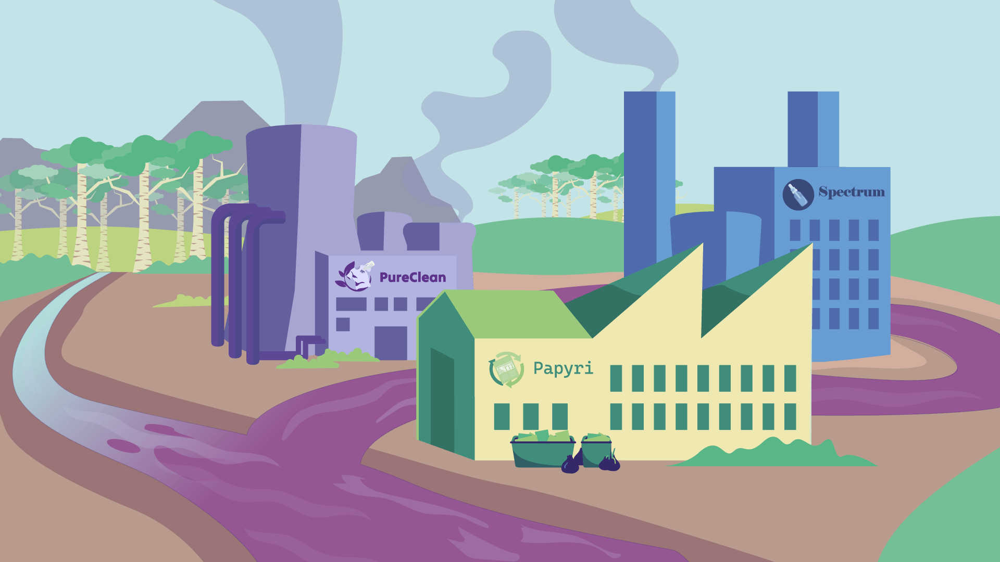

Si estás buscando maneras originales de enseñar ciencia, los materiales educativos de [**RadicalZ**](https://radicalz.eu/) pueden ser una opción interesante. Este **proyecto europeo** de investigación ha desarrollado **recursos gratuitos** que mezclan **aprendizaje** y **entretenimiento**, ayudando a que tus estudiantes se adentren en el mundo de las [**enzimas**](https://es.wikipedia.org/wiki/Enzima) y la [**sostenibilidad**](https://es.wikipedia.org/wiki/Sostenibilidad).

## Cómic

Para los más pequeños (de 8 a 12 años), tienen un **cómic** corto y colorido donde un grupo de jóvenes exploradores se embarca en una misión para salvar la naturaleza de la contaminación. A través de la historia, aprenderán sobre las [**enzimas**](https://es.wikipedia.org/wiki/Enzima), esas moléculas microscópicas que pueden tener un gran impacto en el medio ambiente. Es un recurso útil para clases o periodo vacacional, y lo puedes **descargar** gratuitamente en varios idiomas, como español, inglés, alemán y croata, [**aquí**](https://radicalz.eu/resources/).

## Escape Room Digital

Si trabajas con estudiantes mayores, [**RadicalZ**](https://radicalz.eu/) también ofrece una **Escape Room Digital** interactiva para alumnado de 12 años en adelante. En esta actividad, tus alumnos y alumnas pondrán a prueba su capacidad de resolver problemas a través de **acertijos** y **retos** ambientados en un laboratorio, todo mientras descubren cómo las [**enzimas**](https://es.wikipedia.org/wiki/Enzima) pueden contribuir a una industria más sostenible. La actividad dura unos 45 minutos y se puede hacer en el aula, con un margen de tiempo para discutir lo aprendido después. Está **disponible** en español e inglés [**aquí**](https://radicalz.eu/escape-room/).

Estos **recursos** son **gratuitos** y están pensados para profesorado que busca maneras creativas de motivar a sus estudiantes a aprender sobre ciencia y sostenibilidad. ¡Vale la pena echarles un vistazo!

{}
[RadicalZ](https://radicalz.eu/) es un proyecto de investgación que impulsa el uso de enzimas para crear productos de consumo más sostenibles, acelerando los procesos de diseño y modificación de enzimas mediante técnicas innovadoras de microfluídica y machine learning. El proyecto lo forman 12 instituciones alrededor de Europa, con coordinación desde la Universidad Autónoma de Madrid. Ha sido financiado por la Unión European dentro del programa Horizon 2020 de investigación e innovación (grant No. 101000560).
{}
