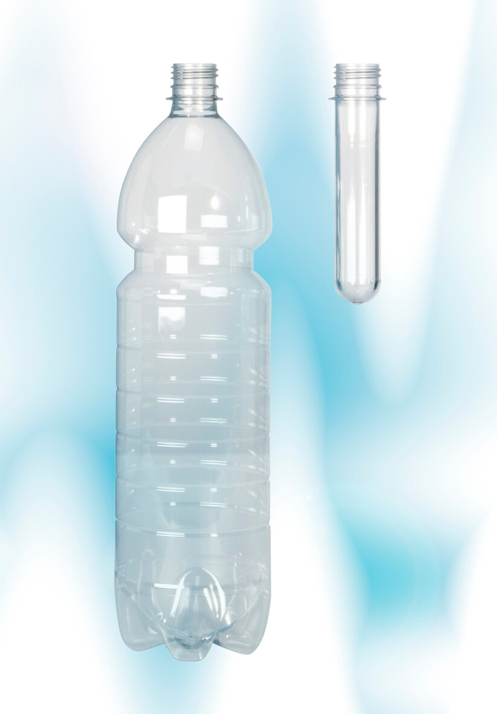
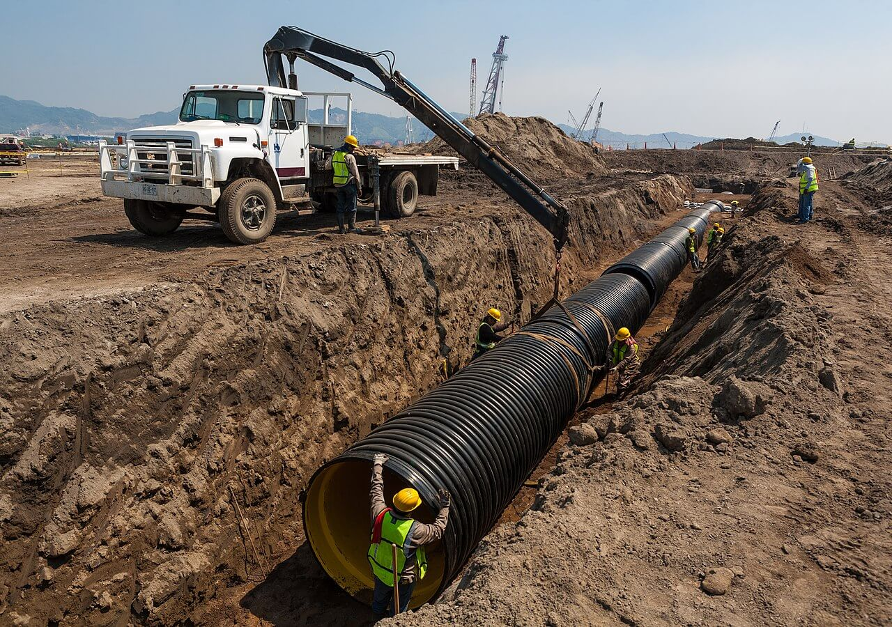

{}
En esta entrada analizamos las principales **propiedades** y **usos** de los seis **plásticos básicos** o de **consumo** ([***commodity plastics***](https://en.wikipedia.org/wiki/Commodity_plastics) en inglés), en contraposición a los conocidos como [**plásticos** de **ingeniería**](https://es.wikipedia.org/wiki/Plásticos_de_ingenier%C3%ADa) o [**plásticos** de **alto rendimiento**](https://en.wikipedia.org/wiki/High-performance_plastics).

Tras leer la entrada, te animamos a que intentes responder las preguntas que encontrarás en el [**cuestionario autocorregible**](#cuestionario-autocorregible).
{}

{}

El siguiente gráfico muestra la **demanda** de [**plásticos**](https://es.wikipedia.org/wiki/Plástico) en **Europa** por **sector** y **polímero** en **2020**. Los **envases/embalajes** (dominados por el [**LDPE**](#x2676-ldpe)) y la **construcción** (dominada por el [**PVC**](#x2675-pvc)) representan, con mucho (> 60&thinsp;% entre ambos), los mayores mercados de uso final. El [**polipropileno (PP)**](#x2677-pp) es el polímero individual más demandado (casi un 20&thinsp;% de toda la demanda mundial), aunque es superado por el [**polietileno**](https://es.wikipedia.org/wiki/Polietileno) ([**LDPE**](#x2676-ldpe) + [**HDPE**](#x2674-hdpe)), con más de un 30&thinsp;% de la demanda mundial.

{{< figure src="demanda-plasticos-2021.svg" title="Demanda de plásticos en Europa por sector y polímero en 2020. LLDPE representa al [LDPE lineal](https://en.wikipedia.org/wiki/Linear_low-density_polyethylene), PS–E al [poliestireno expandido](https://es.wikipedia.org/wiki/Poliestireno_expandido), ABS al [acrilonitrilo butadieno estireno](https://es.wikipedia.org/wiki/Acrilonitrilo_butadieno_estireno), SAN al [estireno acrilonitrilo](https://es.wikipedia.org/wiki/Estireno_acrilonitrilo), PMMA al [metacrilato](https://es.wikipedia.org/wiki/Polimetilmetacrilato), PA a la [poliamida](https://es.wikipedia.org/wiki/Poliamida), PC al [policarbonato](https://es.wikipedia.org/wiki/Policarbonato) y PUR al [poliuretano](https://es.wikipedia.org/wiki/Poliuretano). Traducido y adaptado de https://plasticseurope.org/knowledge-hub/plastics-the-facts-2021/." lightbox="false" width="100%" theme="light" >}}

## &#x2673; PET
El [**tereftalato de polietileno**](https://es.wikipedia.org/wiki/Tereftalato_de_polietileno) (PET o PETE por sus siglás en inglés) es el [**polímero**](https://es.wikipedia.org/wiki/Pol%C3%ADmero) [**termoplástico**](https://es.wikipedia.org/wiki/Termoplástico) más común dentro de la familia de los [**poliésteres**](https://es.wikipedia.org/wiki/Poliéster).

#### Fórmula molecular
El PET está formado por unidades de (C10H8O4) repetidas:



#### Propiedades

- **Resistencia química**: el PET no reacciona con el agua ni con los alimentos, lo que constituye una de las razones por las que se utiliza para los envases de consumo.
- **Resistencia**: es tenaz y resistente a impactos (no se rompe ni se fractura).
- **Transparencia**: el PET puede ser transparente u opaco dependiendo de su procesamiento.
- **Densidad**: junto con el [PVC](#x2675-pvc), son los únicos cuya densidad es mayor que la del agua.

#### Principales usos
La mayor aplicación es en **fibras textiles** (más del 60&thinsp;%, donde es conocido como **poliéster**), y la producción de **envases**, tanto rígidos como flexibles (alrededor del 30&thinsp;% de la demanda mundial de **botellas**).

 Klimešová](https://pixabay.com/es/users/maky_orel-436253/) en [Pixabay](https://pixabay.com/es/).")

También se utiliza en [**módulos fotovoltaicos**](https://es.wikipedia.org/wiki/Energ%C3%ADa_solar_fotovoltaica) y como componente (junto con fibras de vidrio) de **resinas termoplásticas**.

#### ♻️ Reciclaje
Actualmente solo las **botellas** de PET [**se reciclan**](https://es.wikipedia.org/wiki/Reciclaje) a una escala significativa[^1], siendo el &#x2673; su [**código de identificación de resina**](https://es.wikipedia.org/wiki/Código_identificador_de_resina) (RIC por sus siglas en inglés, ver nota al final de la entrada).

[^1]: La mayor parte se recicla de nuevo en botellas, el resto se destina a fibras, películas, envases termoformados y [flejes](https://es.wikipedia.org/wiki/Fleje).

## &#x2674; HDPE
El [**polietileno de alta densidad**](https://es.wikipedia.org/wiki/Polietileno_de_alta_densidad) (HDPE o PE-HD, por sus siglas en inglés) es un [**polímero**](https://es.wikipedia.org/wiki/Pol%C3%ADmero) [**termoplástico**](https://es.wikipedia.org/wiki/Termoplástico) producido a partir del monómero [**etileno**](https://es.wikipedia.org/wiki/Etileno).

#### Fórmula molecular
El HDPE está formado por unidades de (CH2–CH2) repetidas:



#### Propiedades

- El HDPE es conocido por su **alta relación resistencia/densidad**.
- En comparación con el [LDPE](#x2676-ldpe), es más **duro** y más **opaco** y puede soportar temperaturas algo más elevadas (120&thinsp;&deg;C durante periodos cortos).
- Es **resistente a muchos disolventes**, lo que dificulta su pegado[^2].

[^2]: La unión de tuberías debe realizarse mediante soldadura.

#### Principales usos
Se utiliza para fabricar **envases** (sobre todo botellas, aunque también recipientes de productos químicos, como botes de champú), **juguetes** y **tuberías**.

#### ♻️ Reciclaje
El HDPE se suele **reciclar**, siendo el &#x2674; su [**código de identificación de resina**](https://es.wikipedia.org/wiki/Código_identificador_de_resina) (RIC por sus siglas en inglés, ver nota al final de la entrada).

## &#x2675; PVC

El [**cloruro de polivinilo**](https://es.wikipedia.org/wiki/Policloruro_de_vinilo) (PVC o V, por sus siglas en inglés) es el tercer [**polímero**](https://es.wikipedia.org/wiki/Pol%C3%ADmero) sintético de [**plástico**](https://es.wikipedia.org/wiki/Plástico) más producido en el mundo (después del [polietileno](https://es.wikipedia.org/wiki/Polietileno) y el [polipropileno](#x2677-pp)).

#### Fórmula molecular
El PVC está formado por unidades de (C2H3Cl) repetidas:



#### Propiedades
El PVC es un polímero [**termoplástico**](https://es.wikipedia.org/wiki/Termoplástico) que se presenta en dos formas básicas: **rígido** y **flexible**.

- **Densidad**: el PVC es muy denso en comparación con la mayoría de los plásticos[^3].
- **Economía**: el PVC es fácil de conseguir y barato.
- **Dureza**: el PVC rígido tiene una buena clasificación en cuanto a dureza y durabilidad.
- **Resistencia**: el PVC rígido tiene una excelente resistencia a la tracción.

[^3]: El PVC rígido tiene una densidad superior a 1.3&thinsp;g/cm3, mientras que el PVC flexible tiene una densidad entre 1.1&thinsp;g/cm3 y 1.3&thinsp;g/cm3, por lo que no flota en el agua.

#### Principales usos
##### Rígido
Se utiliza en la **construcción** para **tuberías** (aproximadamente la mitad de la resina de PVC fabricada anualmente en el mundo se utiliza para producir tuberías para aplicaciones municipales e industriales) y en aplicaciones de perfiles como **puertas** y **ventanas**.

.jpg.")

También se utiliza en la fabricación de **botellas** de plástico, **envases** no alimentarios, **láminas** para cubrir alimentos y **tarjetas** de plástico (como las bancarias o de socios).

##### Flexible
También se utiliza en **fontanería**, **aislamiento** de **cables** eléctricos, **imitación** de **cuero**, **suelos**, **señalización**, [**discos fonográficos**](https://es.wikipedia.org/wiki/Disco_fonográfico), productos **inflables** y muchas aplicaciones en las que sustituye al caucho.

 reproduciéndose en un [tocadiscos](https://es.wikipedia.org/wiki/Tocadiscos). Foto de [James Sutton](https://unsplash.com/@jamessutton_photography) en [Unsplash](https://unsplash.com/es).")

Con algodón o lino, se utiliza en la producción de **lonas**.

#### ♻️ Reciclaje
Un problema importante en el reciclaje del PVC es el alto contenido de cloro (57&thinsp;% en masa) en el PVC crudo y los altos niveles de aditivos peligrosos que se añaden al polímero para lograr la calidad deseada del material. Como resultado, el PVC requiere una separación de otros plásticos antes de su reciclaje. El [**código de identificación de resina**](https://es.wikipedia.org/wiki/Código_identificador_de_resina) (RIC por sus siglas en inglés, ver nota al final de la entrada) del PVC es el &#x2675;.

## &#x2676; LDPE

El [**polietileno de baja densidad**](https://es.wikipedia.org/wiki/Polietileno_de_baja_densidad) (LDPE o PE-LD, por sus siglas en inglés) es un [**polímero**](https://es.wikipedia.org/wiki/Pol%C3%ADmero) [**termoplástico**](https://es.wikipedia.org/wiki/Termoplástico) producido a partir del monómero [**etileno**](https://es.wikipedia.org/wiki/Etileno). Fue el primer grado del [**polietileno**](https://es.wikipedia.org/wiki/Polietileno), producido en 1933, aunque continúa siendo un plástico importante a pesar de la competencia de polímeros más modernos.

#### Fórmula molecular
El LDPE está formado por unidades de (CH2–CH2) repetidas:



#### Propiedades

- A temperatura ambiente no es reactivo, excepto a los oxidantes fuertes; algunos disolventes hacen que se hinche.
- Puede soportar temperaturas de 65&thinsp;&deg;C de forma continuada y 90&thinsp;&deg;C durante un corto periodo de tiempo.
- Se fabrica en variaciones translúcidas y opacas.
- Es bastante flexible y resistente.

#### Principales usos
El LDPE se utiliza ampliamente para la fabricación de diversos **contenedores**, **botellas** dispensadoras y de lavado, **tubos**, piezas de plástico para **componentes informáticos** y diversos **equipos de laboratorio moldeados**. Su uso más común es el de las [**bolsas de plástico**](https://es.wikipedia.org/wiki/Bolsa_de_plástico).

.")

#### ♻️ Reciclaje
El LDPE se puede **reciclar**[^4], siendo el &#x2676; su [**código de identificación de resina**](https://es.wikipedia.org/wiki/Código_identificador_de_resina) (RIC por sus siglas en inglés, ver nota al final de la entrada).

[^4]: Los productos flexibles son más difíciles de reciclar que los rígidos.

## &#x2677; PP

El [**polipropileno**](https://es.wikipedia.org/wiki/Polipropileno) (PP, por sus siglas en inglés) es el segundo [**polímero**](https://es.wikipedia.org/wiki/Pol%C3%ADmero) más producido en el mundo (después del [polietileno](https://es.wikipedia.org/wiki/Polietileno)).

#### Fórmula molecular
El PP está formado por unidades de (CH3CH–CH2) repetidas:



#### Propiedades

En muchos aspectos es similar al [polietileno](https://es.wikipedia.org/wiki/Polietileno), especialmente en el comportamiento en disolución y las propiedades eléctricas, aunque es más rígido y resistente a deformaciones. El [grupo metilo](https://es.wikipedia.org/wiki/Alquilo) mejora las propiedades mecánicas y la resistencia térmica, aunque disminuye la resistencia química.

- El PP es el plástico de consumo con **menor densidad**.
- Es normalmente **resistente** y **flexible**.
- Razonablemente **económico**.
- Buena **resistencia** a la **fatiga**.
- A temperatura ambiente, es **resistente** a las **grasas** y a casi todos los **disolventes orgánicos**[^5], aparte de los oxidantes fuertes. Los ácidos y las bases no oxidantes pueden almacenarse en recipientes de PP.
- Suele ser **opaco**[^6] o estar coloreado con pigmentos.

[^5]: A temperaturas elevadas (> 140&thinsp;&deg;C) se puede disolver en disolventes no polares, como el [xileno](https://es.wikipedia.org/wiki/Xileno).

[^6]: Puede hacerse translúcido cuando no está coloreado, pero no es tan fácil de hacer transparente como el [poliestireno](#x2678-ps), el [metacrilato](https://es.wikipedia.org/wiki/Polimetilmetacrilato) u otros plásticos.

#### Principales usos
Como el PP es resistente a la fatiga, la mayoría de las **bisagras** de plástico, como las de las botellas abatibles, están hechas de este material.

) abierta, mostrando su [código de identificación de resina](https://es.wikipedia.org/wiki/Código_identificador_de_resina) (&#x2677;) y bisagra. Fuente: https://commons.wikimedia.org/wiki/File:Mint_box_polypropylene_lid.JPG.")

También se utiliza en **envases** flexibles y rígidos, en la **industria** de la **moda** y del **deporte** ([no tejidos](https://es.wikipedia.org/wiki/Tela_no_tejida)), en **medicina** ([Prolene&reg;](https://es.wikipedia.org/wiki/Prolene)), en **productos** de **consumo** (alfombras, juguetes, equipaje, contenedores varios, etc.) o en la **industria** del **automóvil**.

#### ♻️ Reciclaje
El PP es **reciclable**, siendo el &#x2677; su [**código de identificación de resina**](https://es.wikipedia.org/wiki/Código_identificador_de_resina) (RIC por sus siglas en inglés, ver nota al final de la entrada). Sin embargo, solo alrededor del 1&thinsp;% de todo el polipropileno de los Estados Unidos se recicla realmente.

## &#x2678; PS

El [**poliestireno**](https://es.wikipedia.org/wiki/Poliestireno) (PS, por sus siglas en inglés) es un [**polímero**](https://es.wikipedia.org/wiki/Pol%C3%ADmero) sintético hecho de monómeros del hidrocarburo aromático [**estireno**](https://es.wikipedia.org/wiki/Estireno).

#### Fórmula molecular
El PS está formado por unidades de (C8H8) repetidas:



#### Propiedades

El poliestireno puede ser **sólido** o estar en forma de **espuma** ([**expandido** (EPS)](https://es.wikipedia.org/wiki/Poliestireno_expandido) o [**extruido** (XPS)](https://es.wikipedia.org/wiki/Poliestireno_extruido)).

- Es **transparente** por naturaleza, pero puede colorearse con colorantes.
- Es **duro** y **frágil**.
- Es una resina **barata** por unidad de peso.
- Es una **mala barrera** contra el oxígeno y el vapor de agua.
- Tiene un **punto** de **fusión** relativamente **bajo**.
- Como polímero [**termoplástico**](https://es.wikipedia.org/wiki/Termoplástico), se encuentra en estado sólido (vítreo) a temperatura ambiente, pero fluye si se calienta por encima de unos 100&thinsp;&deg;C, su temperatura de [**transición vítrea**](https://es.wikipedia.org/wiki/Transición_V%C3%ADtrea). Vuelve a ser rígido cuando se enfría. Este comportamiento térmico se aprovecha para la [**extrusión**](https://es.wikipedia.org/wiki/Poliestireno_extruido) y también para el [**moldeo** en **vacío**](https://es.wikipedia.org/wiki/Moldeo_en_vac%C3%ADo), ya que puede fundirse en moldes con detalles finos.

#### Principales usos
Entre sus usos se encuentran **embalajes** de **protección**, **contenedores**, **tapas**, **botellas**, **bandejas**, **vasos**, **cubiertos desechables**, en la fabricación de **maquetas** y como material alternativo para los [**discos fonográficos**](https://es.wikipedia.org/wiki/Disco_fonográfico).

](https://es.wikipedia.org/wiki/Poliestireno_expandido). Fuente: https://commons.wikimedia.org/wiki/File:Expanded_polystyrene_foam_dunnage.jpg.")

#### ♻️ Reciclaje
La **mayoría** de los productos de poliestireno **no se reciclan** actualmente debido a la falta de incentivos para invertir en las compactadoras y los sistemas logísticos necesarios. El &#x2678; es su [**código de identificación de resina**](https://es.wikipedia.org/wiki/Código_identificador_de_resina) (RIC por sus siglas en inglés, ver nota al final de la entrada).

{}
Tras la revisión de 2013 del [estándar ASTM D7611/D7611M-21](https://www.astm.org/d7611_d7611m-21.html), las flechas que forman el [símbolo de reciclaje](https://es.wikipedia.org/wiki/S%C3%ADmbolo_del_reciclaje) universal han sido reemplazadas por un triángulo equilátero, para evitar confusiones sobre su reciclabilidad.

El RIC se ha utilizado a menudo como indicador de reciclabilidad, pero la presencia de un código en un producto de plástico no indica necesariamente que sea reciclable, al igual que su ausencia no significa que el objeto de plástico sea necesariamente irreciclable.
{}

## Cuestionario autocorregible



---
shuffleQuestions: true // shuffle questions for each quiz
---

### ¿Cuál de estos plásticos **domina** el **sector** de los **envases/embalajes**?

1. [ ] PET
1. [ ] HDPE
1. [ ] PVC
1. [x] LDPE
1. [ ] PP
1. [ ] PS

### ¿Cuál de estos plásticos **domina** el **sector** de la **construcción**?

1. [ ] PET
1. [ ] HDPE
1. [x] PVC
1. [ ] LDPE
1. [ ] PP
1. [ ] PS

### ¿Cuáles de estos mercados son los que más plásticos demandan?

- [x] Envases/embalajes
- [x] Construcción
- [ ] Automoción
- [ ] Electricidad y electrónica
- [ ] Agricultura
- [ ] Hogar, ocio y deporte

### ¿Cuál de estos plásticos es el **más demandado** individualmente?

1. [ ] PET
1. [ ] HDPE
1. [ ] PVC
1. [ ] LDPE
1. [x] PP
1. [ ] PS

### ¿Cuál de estos plásticos se utiliza mayoritariamente para fabricar **fibras textiles**?

1. [x] PET
1. [ ] HDPE
1. [ ] PVC
1. [ ] LDPE
1. [ ] PP
1. [ ] PS

### ¿Cuáles de estos plásticos son **transparentes** por naturaleza?

- [ ] PET
- [ ] HDPE
- [x] PVC
- [ ] LDPE
- [ ] PP
- [x] PS

### ¿Qué plástico es el más utilizado en el mundo para fabricar **botellas**?

- [x] PET
- [ ] HDPE
- [ ] PVC
- [ ] LDPE
- [ ] PP
- [ ] PS

### ¿Cuáles de estos plásticos **no flotan** en el **agua**?

- [x] PET
- [ ] HDPE
- [x] PVC
- [ ] LDPE
- [ ] PP
- [ ] PS

### ¿Cuáles de estos plásticos se suelen reciclar?

- [x] PET
- [x] HDPE
- [ ] PVC
- [x] LDPE
- [x] PP
- [ ] PS

### ¿Cuáles de estos plásticos contienen en su molécula algún elemento que no sea C o H?

- [x] PET
- [ ] HDPE
- [x] PVC
- [ ] LDPE
- [ ] PP
- [ ] PS

