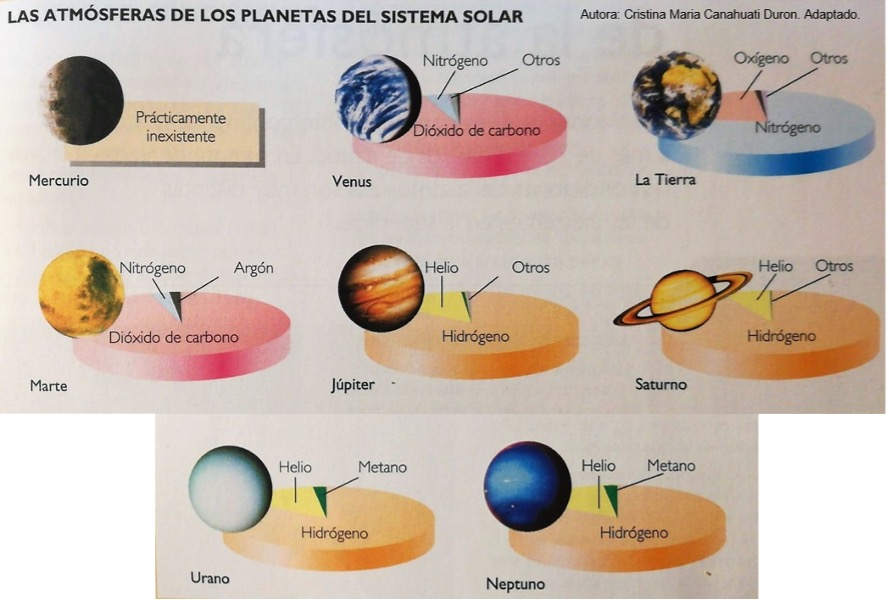

{}
Entrada basada en el siguiente hilo de Twitter:



{}

{}
La **fuente principal** con la que he preparado esta entrada ha sido [un **artículo** de Manuel Alonso Sánchez, Salvador Martínez y Jaime Carrascosa sobre la velocidad de escape](http://rsefalicante.umh.es/TemasCampo_gravitatorio/Documentos/Articulo_velocidad_de_escape.pdf), publicado en la **revista Alambique**, Didáctica de las Ciencias Experimentales en julio de este año. 
{}

¿Por qué la **Luna** no tiene **atmósfera**, si se encuentra casi a la misma distancia del Sol que la Tierra? Para responder a esta pregunta, vamos a ver un modelo de física básica que primero nos dará la velocidad a la que hay que lanzar una pelota para que escape de nuestro planeta. Empecemos con la segunda cuestión, en la que aprenderemos de qué depende que algo escape de su planeta o satélite. Para responder a esa pregunta, debemos relacionar la velocidad a la que lo lancemos con la atracción gravitatoria del planeta.

{{% lottie src="cohete.tgs" width="100%" %}}

Como en [mi entrada del hielo y la rotación de la Tierra](), hay que hacer aproximaciones de [vaca esférica](https://es.wikipedia.org/wiki/Vaca_esférica) para simplificar el problema. Asumimos que la Tierra es una esfera homogénea y no tenemos en cuenta el rozamiento del aire ni la rotación del planeta sobre sí mismo. Para obtener la [**velocidad** de **escape**](https://es.wikipedia.org/wiki/Velocidad_de_escape) igualamos la energía cinética de la pelota con su energía gravitatoria[^1]: 

[^1]: Dependiendo de la velocidad de lanzamiento del proyectil, la energía total del sistema que forman la Tierra y el proyectil puede ser positiva o negativa. Si es negativa el sistema estará ligado, en el sentido de que el proyectil no podrá escapar del campo gravitatorio de la Tierra, y si es positiva el proyectil escapará de dicho campo gravitatorio terrestre. El caso frontera, en el que la energía total del sistema Tierra-proyectil es igual a cero, corresponde a que éste inicie su movimiento a la velocidad de escape. Nota: El lanzamiento se produce desde la superficie de la Tierra (*r* = *R*T).

\begin{gather*}
\overbrace{E_\mathrm c = \frac{1}{2}mv^2}^{\text{Energía cinética}}; \qquad \overbrace{E_\mathrm p = -\frac{GmM_\mathrm T}{R_\mathrm T}}^{\text{Energía potencial gravitatoria}} \\\\
E_\mathrm{sist} = 0 \Rightarrow v_\mathrm{escape} = \sqrt{\frac{2GM_\mathrm T}{R_\mathrm T}}
\end{gather*}

Un tema relacionado con esto es el rango de velocidades para poner un objeto en órbita en torno a su planeta. En este hilo, [Antonio J. Cuesta](https://twitter.com/aj_cuesta) lo explica de forma intuitiva:



Sigamos con nuestra entrada y analicemos la velocidad de escape de nuestro planeta. Para la Tierra obtenemos una velocidad de escape de 11.2&thinsp;km/s, 33 veces la velocidad del sonido en el aire. Cualquier objeto lanzado a menor velocidad caerá de nuevo. Como veis, el valor depende de la masa del planeta, *M*, y de su radio, *R*: hace falta una mayor velocidad a mayor *M* y menor *R*.

, de ahí que se hable del radio del planeta. Adaptada de https://ualr.edu/tv/2021/05/27/june-2021-black-hole-summer/escape-velocity/.")

Quizá lo más interesante sea de qué NO depende la velocidad de escape. En este modelo NO depende de la masa del objeto que lanzamos[^2]. Por tanto, en la gráfica de debajo, que ampliaremos más adelante, cada planeta (punto naranja) tiene su velocidad de escape (eje y).

[^2]: De forma más precisa, la velocidad de escape depende de la [**masa gravitatoria**](https://es.wikipedia.org/wiki/Masa_gravitacional) de la pelota; cuanto mayor sea, más atraída se ve por la Tierra. Pero también depende de su [**masa inercial**](https://es.wikipedia.org/wiki/Masa_inercial), que actúa de manera opuesta. [Ambas son equivalentes](http://rsefalicante.umh.es/TemasMasas/masasycaida05.htm) y se compensan en ausencia de rozamiento ([principio de equivalencia débil](https://es.wikipedia.org/wiki/Principio_de_equivalencia#Principio_de_equivalencia_débil)).

{{< figure src="velocidad-escape-temperatura-planetas.jpg" title="Velocidad de escape (eje y) de distintos planetas y de la Luna en función de su temperatura promedio (eje x). Como hemos visto, el punto naranja aparece más arriba según aumente la masa/radio del planeta. Se representa 1/6 de la velocidad de escape porque ese cociente será importante más adelante. En el eje x, se representa la temperatura promedio en la superficie del planeta, de nuevo, porque va a ser necesaria más adelante. Adaptada de http://rsefalicante.umh.es/TemasCampo_gravitatorio/Documentos/Articulo_velocidad_de_escape.pdf." id="velocidad-escape-temperatura" numbered="true">}}

Ahora vamos a usar las velocidades de escape que hemos obtenido como límite para que un planeta retenga sus átomos o moléculas de gas. Nos toca preguntarnos ahora a qué velocidad promedio circulan las moléculas de distintos gases para saber si el planeta los podrá retener o no.

Los átomos o moléculas del gas siguen una distribución estadística de velocidades en torno a cierta velocidad de traslación promedio &lt;*v*&gt;. Aplicando la [**teoría cinética**](https://es.wikipedia.org/wiki/Teor%C3%ADa_cinética_de_los_gases) se llega a la expresión de debajo, donde se deduce que cuanto menor masa tenga la molécula, en promedio más rápido viajará.

$$
\frac{3k_\mathrm B T}{2} = \frac{1}{2}m\langle v\rangle^2 \rightarrow \langle v\rangle = \sqrt{\frac{3k_\mathrm B T}{m}}
$$

 o la misma molécula a distinta temperatura (azul vs. rojo). Como el oxígeno es más liviano que el CO2, su velocidad promedio es mayor, como también se ve en las ecuaciones de arriba. Fuente: https://homepages.abdn.ac.uk/j.s.reid/pages/Maxwell/Legacy/MaxDistrb.html.")

Resumiendo, la velocidad mínima para que una partícula escape del planeta depende de propiedades del planeta, pero no de la masa de la partícula. Por otro lado, cada tipo de molécula de gas viaja en promedio a cierta velocidad dada por su masa y la temperatura a la que esté:

$$
v_\mathrm{escape} = \sqrt{\frac{2GM}{R}}; \qquad \langle v\rangle = \sqrt{\frac{3k_\mathrm B T}{m}}
$$

Con eso representamos la [figura 1](#figure-velocidad-escape-temperatura) y comparamos la velocidad promedio de las moléculas con 1/6 de la velocidad de escape: el planeta retendrá aquellas cuya línea quede por debajo de su punto naranja. Esto nos da algunas claves para su composición atmosférica:

 comparada con 1/6 de la velocidad de escape en los distintos planetas y en la Luna. El factor 1/6 tiene en cuenta la dispersión en velocidades de las moléculas, imponiendo retener casi el 100&thinsp;% de ellas durante mucho tiempo. En este modelo, el planeta podría mantener una atmósfera de esa molécula si se encuentra por encima de su línea punteada azul correspondiente. Para la temperatura de cada planeta, los autores tomaron una temperatura promedio en la superficie del mismo. Autores: Manuel Alonso Sánchez, Salvador Martínez y Jaime Carrascosa.")

Con este modelo, resumido en la gráfica anterior, es comprensible que las atmósferas de Júpiter o Saturno sean principalmente de H2 y He (lo más común en el Universo) mientras que, como estos gases escapan fácilmente de Venus o la Tierra, queden atmósferas de gases más pesados.

El planeta de nuestro sistema solar con menor velocidad de escape, Mercurio, a efectos prácticos no tiene atmósfera. Marte tiene una atmósfera muy tenue, cuya presión es de unos 600&thinsp;Pa, menos del 1&thinsp;% respecto a la de la Tierra (una atmósfera residual, como me apuntó mi amigo el astrofísico [Rodrigo González Peinado](https://twitter.com/rodrigogpeinado)). Los planetas terrestres tienen una velocidad de escape menor que la de los planetas jovianos, lo que les ha impedido retener grandes cantidades de hidrógeno y helio.

¿Y la Luna? Aunque su temperatura sea similar a la de la Tierra, debido a su menor masa/radio, su velocidad de escape es menor (2.4&thinsp;km/s vs 11.2&thinsp;km/s). Las moléculas de los principales gases escapan rápidamente y, por ello, no puede retener una atmósfera con ellas.

{{< figure src="velocidad-escape-moleculas-Luna.jpg" title="Velocidad de los distintos tipos de moléculas gaseosas de distinta especie en función de la temperatura (líneas punteadas azules) comparada con 1/6 de la velocidad de escape en la Tierra y en la Luna. Según este modelo, la Tierra no puede mantener una atmósfera de hidrógeno mientras que la Luna no puede mantener una atmósfera de ninguno de los gases representados en la figura. Editada de http://rsefalicante.umh.es/TemasCampo_gravitatorio/Documentos/Articulo_velocidad_de_escape.pdf." numbered="true">}}

{}
Como puede verse en la figura 2, nuestro planeta debería de poder retener el helio. Sin embargo, parece que la mayor parte del helio escapa por los polos debido a un fenómeno conocido como [***viento polar***](https://en.wikipedia.org/wiki/Polar_wind).
{}

Así terminaría esta entrada sobre la velocidad de escape, donde hemos empezado viendo a qué velocidad hay que lanzar una pelota para que escape de la Tierra para terminar entendiendo por qué la Luna no retiene apenas gases a su alrededor. Un momento..., ¿por qué escribo *apenas*?

<iframe src="https://giphy.com/embed/dSd0f3W5zOzAmBfeW3" width="100%" height="100%" style="position:absolute" frameBorder="0" class="giphy-embed" allowFullScreen></iframe>

<a href="https://giphy.com/gifs/foxtv-fox-proven-innocent-innocentonfox-dSd0f3W5zOzAmBfeW3">via GIPHY</a>

Porque, aunque a efectos prácticos la Luna no tiene atmósfera por lo visto en esta entrada, si uno mide la composición gaseosa sobre su superficie, encuentra mayormente argón, helio y neón, si bien la presión es un billón (1012) de veces menor que en la atmósfera terrestre.

 durante la misión Apollo 17. Créditos: NASA. Más información aquí: https://www.nasa.gov/mission_pages/LADEE/news/lunar-atmosphere.html")

Si bien estos elementos gaseosos no aguantan mucho tiempo en la Luna, se ven reemplazados por nuevos, emitidos por el propio satélite.